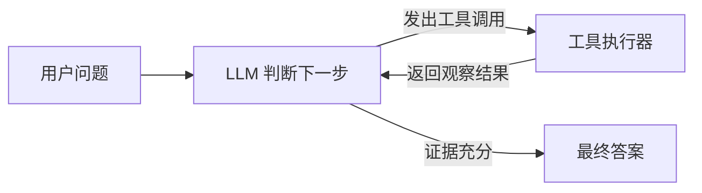

# Day 1：第一次看懂 HolmesGPT Agent

日期：2026-09-22

这一天不是要学会整个 HolmesGPT，而是完成一个最小闭环：**把项目运行起来，让 Agent 自己检查仓库，并判断它为什么得出“主入口是 `holmes/main.py`”这个结论。**

读完本文，你应该能够回答四个问题：

1. 普通 ChatCompletion 和 Agent 有什么区别？
2. HolmesGPT 如何调用远程 DeepSeek 模型？
3. Agent 如何通过工具查找证据，而不是直接猜答案？
4. 为什么这个项目的主 Python 入口是 `holmes/main.py` 中的 `run()`？

如果你希望沿着真实代码逐步跟踪，请阅读配套的 [`holmes ask` 完整源码链路](source-walkthrough.md)。它从 shell、Typer CLI、配置和 Prompt 构造讲到 LiteLLM、DeepSeek、工具审批、循环终止与最终输出。

## 1. 今天实际完成了什么

我们完成了下面这条链路：

```text
安装依赖
  ↓
运行 107 个普通测试
  ↓
配置 DeepSeek API Key
  ↓
用 DeepSeek V4.1 Flash 运行 holmes ask
  ↓
Agent 调用工具读取仓库
  ↓
根据代码证据判断主入口
```

最终结论是：

```text
命令行主入口：holmes/main.py -> run()
```

这不是仅凭文件名猜出来的。后文会逐层核对证据。

## 2. ChatCompletion 和 Agent 的区别

普通 ChatCompletion 可以简化为：

```text
用户问题 -> 模型 -> 文本答案
```

模型只能依据提示词和训练时学到的知识作答。如果模型没有看到你的本地仓库，它就无法可靠地知道仓库中有哪些文件。

Agent 在模型和工具之间增加了一个循环：



在本次实验中：

- LLM 是 DeepSeek V4.1 Flash。
- 工具是 HolmesGPT 提供的 `bash` 工具。
- 观察结果是命令读取到的文件内容和错误信息。
- 模型根据观察结果决定继续查找，或者停止并回答。

因此，Agent 不是一个新的模型。它更像是：**LLM + 工具 + 多轮决策循环**。

## 3. 为什么使用远程 DeepSeek，而不是本地小模型

HolmesGPT 通过 LiteLLM 统一不同模型供应商的调用方式。我们使用的模型名是：

```text
deepseek/deepseek-flash
```

其中：

- `deepseek/` 告诉 LiteLLM 使用 DeepSeek 供应商。
- `deepseek-flash` 是 DeepSeek V4.1 Flash 的 API 模型 ID。

API Key 没有写进仓库，而是放在 macOS 当前登录会话的环境中。设置时使用了 `read -s`，其中 `-s` 表示静默输入，所以终端不显示你键入的字符。这是正常的安全行为。

可以用下面的命令检查“是否已经设置”，而不打印密钥本身：

```bash
test -n "$(launchctl getenv DEEPSEEK_API_KEY)" \
  && echo "DeepSeek API Key 已设置" \
  || echo "尚未设置"
```

## 4. 我们运行了什么命令

核心实验命令是：

```bash
DEEPSEEK_API_KEY="$(launchctl getenv DEEPSEEK_API_KEY)" \
poetry run holmes ask \
  "Inspect this repository and identify its main Python entry point" \
  --model="deepseek/deepseek-flash" \
  --show-tool-output \
  --no-interactive \
  --json-output-file /tmp/holmes-day1-deepseek.json
```

每一部分的作用如下：

| 参数 | 作用 |
| --- | --- |
| `DEEPSEEK_API_KEY=...` | 只为本次进程传入 DeepSeek 密钥 |
| `poetry run` | 在项目虚拟环境中执行命令 |
| `holmes ask` | 向 HolmesGPT Agent 提问 |
| `--model` | 指定本次使用的远程模型 |
| `--show-tool-output` | 在终端展示 Agent 的工具调用过程 |
| `--no-interactive` | 得到答案后直接退出，不进入连续对话 |
| `--json-output-file` | 保存结构化运行记录，便于统计和复盘 |

## 5. Agent 是怎样找到主入口的

真正决定最终答案的是以下证据：

| 证据位置 | 看到的内容 | 能说明什么 |
| --- | --- | --- |
| [`pyproject.toml`](../../pyproject.toml) | `holmes = "holmes.main:run"` | 安装后的 `holmes` 命令会调用 `holmes.main.run` |
| [`holmes_cli.py`](../../holmes_cli.py) | `from holmes.main import run` | CLI 包装脚本也指向同一个 `run()` |
| [`holmes/main.py`](../../holmes/main.py) | `def run(): ... app()` | `run()` 是启动 Typer CLI 的函数 |
| [`Dockerfile`](../../Dockerfile) | `ENTRYPOINT ["python", "holmes_cli.py"]` | 容器入口同样经过 `holmes_cli.py` |

把这四层证据串起来，就是：

```text
用户执行 holmes
  ↓
pyproject.toml 指向 holmes.main:run
  ↓
run() 调用 Typer app()
  ↓
没有指定子命令时，默认执行 ask
```

`server.py` 和 `holmes_operator/operator.py` 也是入口，但它们分别服务于 HTTP API 和 Kubernetes Operator，不是这个项目的主命令行入口。

## 6. 为什么一共调用了 12 次模型、22 次工具

这里很容易产生误解：12 次模型调用不等于 12 个不同模型，也不等于调用了 12 次完整命令。

- **12 次模型调用**：Agent 循环中，DeepSeek 被询问了 12 轮“下一步做什么”。
- **22 次工具调用**：模型在这些轮次中一共发出了 22 个 `bash` 请求；一轮模型调用可以产生一个或多个工具请求。

这次运行也暴露了 Agent 的不足：前十次工具调用中有多次权限拒绝、目录读取错误和项目范围外的探索。直到后半段读取 `pyproject.toml`、`holmes/main.py`、`holmes_cli.py` 和 Dockerfile 后，才获得真正有用的证据。

这正是保存工具日志的意义：**模型能力强，不代表每一步都高效或正确。我们需要检查它使用了什么证据，而不能只相信最终措辞。**

原始日志很长，不建议从头通读。复盘时优先查看基线报告中的工具调用 11、16、17、18、19、20 和 22。

## 7. 测试结果应该怎样理解

指定的三个测试文件一共有 107 个测试，全部通过：

```text
107 passed
```

第一次命令的进程退出码仍然是 1，不是因为测试失败，而是因为项目配置了 46% 的全局覆盖率门槛。只运行三个测试文件时，统计到的全仓库覆盖率为 18.59%。

加入 `--no-cov` 后，只判断测试是否通过，命令正常以 0 退出：

```bash
poetry run pytest \
  tests/core/test_prompt.py \
  tests/core/test_tool_executor.py \
  tests/test_tool_calling_llm.py \
  -q --no-cov
```

## 8. 你现在应该真正记住的三件事

1. Agent 的核心不是“聊天”，而是模型根据观察结果反复决定下一步工具调用。
2. 最终答案是否可信，要看工具返回的证据能否支持结论。
3. HolmesGPT 借助 LiteLLM 接入远程模型，因此可以替换本地小模型，而不需要重写 Agent 主流程。

## 9. 动手练习

不看上文答案，尝试完成以下练习：

1. 在 `pyproject.toml` 中找到 `[tool.poetry.scripts]`，解释冒号两侧分别表示什么。
2. 打开 `holmes/main.py`，找到 `run()`，说明没有传子命令时为什么会执行 `ask`。
3. 执行 `poetry run holmes --help`，观察 Typer 注册了哪些命令。
4. 把提问改成 `Identify the HTTP API entry point`，预测 Agent 应该找到哪个文件，再运行验证。

如果你能独立回答前两个问题，Day 1 的核心目标就已经达成。

## 10. 当日产出怎么读

- 当前这份 [`README.md`](README.md) 是面向学习的讲义，应该先读。
- [`source-walkthrough.md`](source-walkthrough.md) 是结合源码的完整调用链讲解，适合在 IDE 中对照阅读。
- [`baseline.md`](baseline.md) 是机器运行的审计记录，用于核对完整输入、工具输出和最终答案，不需要逐行学习。
