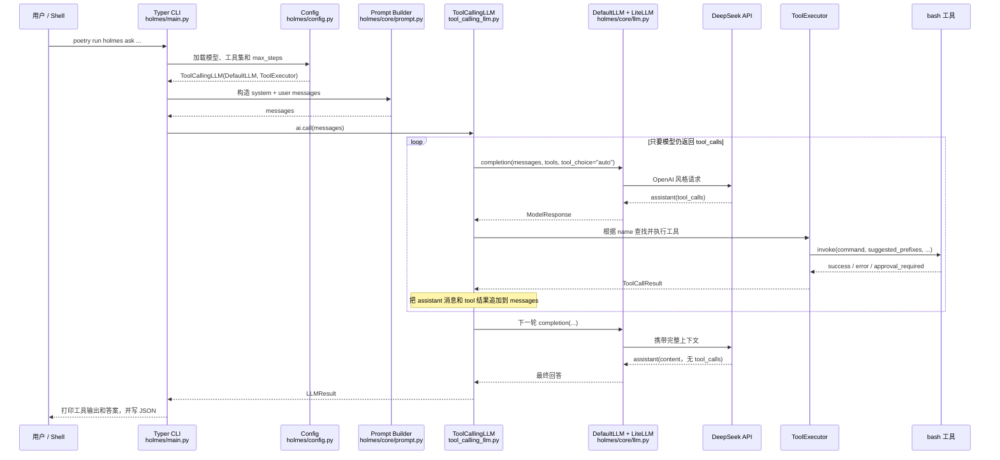

# `holmes ask` 完整源码链路

本文沿着 Day 1 实际执行的命令，从 shell 一直追到 DeepSeek API、工具执行循环和最终输出。

建议先记住一句话：

> `holmes ask` 的本质，是把“对话历史 + 工具定义”反复发送给 LLM；只要 LLM 返回工具调用，HolmesGPT 就执行工具、把结果追加回历史，再请求下一轮，直到 LLM 返回普通文本答案。

## 1. 全链路总览



## 2. 第 0 步：Shell 怎样把密钥交给进程

实际命令的开头是：

```bash
DEEPSEEK_API_KEY="$(launchctl getenv DEEPSEEK_API_KEY)" \
poetry run holmes ask ...
```

这里发生了三件事：

1. `launchctl getenv` 从 macOS 当前登录会话读取密钥。
2. `DEEPSEEK_API_KEY=... command` 只把该变量注入右侧启动的进程及其子进程。
3. 密钥没有写入仓库文件，也没有出现在命令参数中。

HolmesGPT 本身没有专门读取 `DEEPSEEK_API_KEY` 的代码。后面 `DefaultLLM` 调用 LiteLLM 时，如果没有显式传入 `api_key`，LiteLLM 会根据 `deepseek/` 供应商前缀读取对应环境变量。

所以数据流是：

```text
launchctl 会话环境
  -> poetry 子进程环境
  -> HolmesGPT Python 进程环境
  -> LiteLLM
  -> DeepSeek HTTP API
```

## 3. 第 1 步：`holmes` 命令从哪里进入 Python

### 3.1 Poetry 注册控制台脚本

[`pyproject.toml`](../../pyproject.toml#L9) 中写着：

```toml
[tool.poetry.scripts]
holmes = "holmes.main:run"
```

冒号左边的 `holmes.main` 是 Python 模块，右边的 `run` 是模块中的函数。因此安装项目后，执行 `holmes` 等价于调用：

```python
from holmes.main import run

run()
```

### 3.2 `run()` 把控制权交给 Typer

[`holmes/main.py`](../../holmes/main.py#L1084) 的入口为：

```python
def run():
    if len(sys.argv) == 1:
        sys.argv.insert(1, "ask")
    app()
```

- 如果只输入 `holmes`，代码会自动补成 `holmes ask`。
- 本次明确输入了 `holmes ask ...`，因此直接由 Typer 找到 `ask()` 命令函数。
- `app()` 负责解析命令、参数和选项，然后调用对应 Python 函数。

仓库根目录的 [`holmes_cli.py`](../../holmes_cli.py) 是另一层很薄的包装，Docker 容器通过它进入同一个 `run()`。

## 4. 第 2 步：Typer 怎样解析本次参数

[`holmes/main.py`](../../holmes/main.py#L193) 使用 `@app.command()` 注册 `ask()`：

```python
@app.command()
def ask(
    prompt: Optional[str] = typer.Argument(...),
    model: Optional[str] = opt_model,
    show_tool_output: bool = typer.Option(False, "--show-tool-output"),
    json_output_file: Optional[str] = opt_json_output_file,
    interactive: bool = typer.Option(True, "--interactive/--no-interactive"),
    ...
):
```

本次参数进入 Python 后，大致是：

```python
prompt = "Inspect this repository and identify its main Python entry point"
model = "deepseek/deepseek-flash"
show_tool_output = True
interactive = False
json_output_file = "/tmp/holmes-day1-deepseek.json"
```

几个容易混淆的点：

- `--show-tool-output` 只控制最终是否把工具结果打印到终端，**不会决定模型能否调用工具**。
- `--no-interactive` 表示完成这一问就退出，**不是关闭 Agent 多轮循环**。
- `--json-output-file` 保存最终结构化结果，不是发给模型的输入。

## 5. 第 3 步：配置、模型和工具执行器如何组装

### 5.1 合并配置

`ask()` 在 [`holmes/main.py`](../../holmes/main.py#L296) 调用：

```python
config = Config.load_from_file(
    config_file,
    api_key=api_key,
    model=model,
    fast_model=fast_model,
    max_steps=max_steps,
    custom_toolsets_from_cli=custom_toolsets,
    ...
)
```

[`Config.load_from_file()`](../../holmes/config.py#L274) 的优先级可以简化为：

```text
配置文件
  <- 被非空 CLI 参数覆盖
  <- 缺失时再使用 MODEL 等环境变量兜底
```

本次 `--model="deepseek/deepseek-flash"` 是 CLI 参数，因此它直接覆盖其他模型来源。

### 5.2 创建三个核心对象

随后 [`create_toolcalling_llm()`](../../holmes/config.py#L674) 组装：

```python
llm = self._get_llm(model_key=model, ...)
tool_executor = self.create_tool_executor(...)
return ToolCallingLLM(
    tool_executor,
    self.max_steps,
    llm,
    tool_results_dir=tool_results_dir,
)
```

可以把三个对象理解为：

| 对象 | 职责 |
| --- | --- |
| `DefaultLLM` | 把统一参数转换为 LiteLLM 调用，并连接具体模型供应商 |
| `ToolExecutor` | 保存可用工具，根据工具名查找并执行工具 |
| `ToolCallingLLM` | 控制“模型调用 → 工具执行 → 再次模型调用”的循环 |

`ask()` 为 CLI 加载 `CORE` 和 `CLI` 标签的工具集，并尽可能启用当前环境可用的工具集。本次启动信息显示 29 个数据源，但实际任务只选择了 `bash`。

### 5.3 模型注册

[`LLMModelRegistry`](../../holmes/core/llm.py#L835) 会把 CLI 指定的模型加入模型表。随后 [`Config._get_llm()`](../../holmes/config.py#L845) 创建：

```python
DefaultLLM(
    model="deepseek/deepseek-flash",
    api_key=None,
    ...
)
```

这里的 `api_key=None` 不表示没有密钥；它表示 HolmesGPT 没有通过 `--api-key` 显式传值，由 LiteLLM 从进程环境读取 `DEEPSEEK_API_KEY`。

## 6. 第 4 步：工具如何变成模型能理解的 JSON Schema

[`ToolExecutor`](../../holmes/core/tools_utils/tool_executor.py#L60) 只保留状态为 `ENABLED` 的工具集，并建立两张索引：

```python
self.tools_by_name[resolved_name] = tool
self._tool_to_toolset[resolved_name] = ts
```

在真正调用模型前，`ToolCallingLLM._get_tools()` 会执行：

```python
tool_executor.get_all_tools_openai_format(...)
```

每个 HolmesGPT `Tool` 都通过 `get_openai_format()` 变成类似下面的结构：

```json
{
  "type": "function",
  "function": {
    "name": "bash",
    "description": "Executes a bash command and returns its output...",
    "parameters": {
      "type": "object",
      "properties": {
        "command": {"type": "string"},
        "suggested_prefixes": {"type": "array"},
        "timeout": {"type": "integer"}
      },
      "required": ["command", "suggested_prefixes"]
    }
  }
}
```

模型收到的是工具说明和参数 Schema，不是 Python 函数对象。模型只负责生成工具名和 JSON 参数；真正执行仍由 HolmesGPT 控制。

## 7. 第 5 步：系统提示词和用户消息怎样生成

非交互分支在 [`holmes/main.py`](../../holmes/main.py#L399) 调用 `build_initial_ask_messages()`。

[`holmes/core/prompt.py`](../../holmes/core/prompt.py#L318) 最终构造：

```python
messages = [
    {"role": "system", "content": system_prompt},
    {"role": "user", "content": user_prompt},
]
```

其中：

- system prompt 来自 `generic_ask.jinja2`，包含通用行为、工具集说明、权限错误处理和风格要求等。
- user prompt 包含我们输入的问题，还可能附加文件内容、技能说明和任务提醒。
- 工具 Schema 不放在 `messages` 文本中，而是作为 `tools=` 参数单独传给模型 API。

所以首轮请求可以抽象为：

```text
messages = [system, user]
tools = [bash schema, 其他可用工具 schema, ...]
tool_choice = "auto"
```

`auto` 的含义是：模型可以直接回答，也可以决定调用一个或多个工具。

## 8. 第 6 步：Agent 循环是怎样工作的

`ask()` 在 [`holmes/main.py`](../../holmes/main.py#L412) 调用：

```python
response = ai.call(messages, ...)
```

### 8.1 同步外壳 `call()`

[`ToolCallingLLM.call()`](../../holmes/core/tool_calling_llm.py#L620) 是同步外壳。它消费 `call_stream()` 产生的事件，累计：

- 所有工具调用；
- 模型调用次数；
- token 和成本统计；
- 最终消息历史。

### 8.2 真正循环 `call_stream()`

核心循环位于 [`ToolCallingLLM.call_stream()`](../../holmes/core/tool_calling_llm.py#L1084)：

```python
while i < max_steps:
    i += 1
    full_response = self.llm.completion(
        messages=messages,
        tools=tools,
        tool_choice="auto",
        stream=False,
        ...
    )

    messages.append(response_message)

    if not response_message.tool_calls:
        return final_answer

    execute_tools()
    messages.append(tool_results)
```

上面是便于理解的等价伪代码。源码还处理了上下文压缩、token 统计、链路追踪、取消请求、审批和前端工具等情况。

### 8.3 为什么每轮都越来越贵

下一轮模型调用会携带前面的完整消息历史：

```text
system
user
assistant(tool_calls)
tool(result)
assistant(tool_calls)
tool(result)
...
```

因此 Day 1 的 `180848 prompt tokens` 是 12 轮请求的累计值，不表示某一轮一次性发送了 18 万 token。轮次越多、工具输出越长，后续重复携带的上下文越大。

## 9. 第 7 步：DeepSeek API 实际在哪里被调用

[`DefaultLLM.completion()`](../../holmes/core/llm.py#L660) 先整理参数，再在 [`holmes/core/llm.py`](../../holmes/core/llm.py#L768) 调用：

```python
result = litellm.completion(
    model="deepseek/deepseek-flash",
    api_key=self.api_key,
    messages=sanitized_messages,
    tools=tools,
    tool_choice="auto",
    stream=False,
    ...
)
```

LiteLLM 根据 `deepseek/` 前缀完成供应商路由、读取环境变量、构造 HTTP 请求，并把 DeepSeek 响应统一转换成 `ModelResponse`。

这层抽象的价值是：上层 `ToolCallingLLM` 不需要知道当前使用 DeepSeek、OpenAI 还是 Anthropic。只要返回格式兼容，它看到的始终是：

```text
assistant.content
assistant.tool_calls
finish_reason
usage
```

## 10. 第 8 步：模型返回工具调用后发生什么

假设模型返回：

```json
{
  "name": "bash",
  "arguments": {
    "command": "head -100 pyproject.toml",
    "suggested_prefixes": ["head"],
    "timeout": 30
  }
}
```

HolmesGPT 的执行链是：

```text
_invoke_llm_tool_call()
  -> json.loads(arguments)
  -> ToolExecutor.get_tool_by_name("bash")
  -> _directly_invoke_tool_call()
  -> tool.invoke(params, context)
  -> RunBashCommand.requires_approval()
  -> RunBashCommand._invoke()
  -> StructuredToolResult
```

相关源码：

- 工具调用解析：[`tool_calling_llm.py`](../../holmes/core/tool_calling_llm.py#L911)
- 工具查找和执行：[`tool_calling_llm.py`](../../holmes/core/tool_calling_llm.py#L788)
- 通用审批入口：[`holmes/core/tools.py`](../../holmes/core/tools.py#L380)
- Bash 参数及安全验证：[`bash_toolset.py`](../../holmes/plugins/toolsets/bash/bash_toolset.py#L94)

同一轮如果模型返回多个工具调用，源码会用最多 16 个工作线程并发执行。因此本次每轮两个 `bash` 调用通常属于同一次模型决策，而不是两次模型请求。

## 11. 为什么有些 Bash 命令被拒绝，Agent 还能继续

Bash 工具不是拿到字符串就立即执行。它先根据 `suggested_prefixes`、允许列表和拒绝列表判断：

```text
ALLOWED             -> 直接执行
DENIED              -> 返回错误
APPROVAL_REQUIRED   -> 请求用户确认
```

本次使用 `--no-interactive`，调用 `ai.call()` 时没有提供审批回调。因此需要人工批准的命令不会挂起等待，而是被转换为明确的错误结果，然后作为 `tool` 消息放回对话历史。

模型下一轮会看到类似：

```text
Tool call rejected: it requires human approval...
```

它于是换用允许的 `head`、`grep` 等命令继续探索。这说明工具错误不是 Python 异常终止，而是 Agent 可以观察并自我修正的一种结果。

## 12. 本次 12 轮模型调用实际做了什么

结构化 JSON 中共有 12 条 assistant 消息：前 11 轮各请求两个 Bash 工具，第 12 轮输出最终文本。

| 模型轮次 | 主要行为 | 评价 |
| --- | --- | --- |
| 1 | 尝试 `pwd`、`ls` | 需要审批，被拒绝 |
| 2–5 | 通过身份信息和目录通配符定位仓库 | 明显绕路，并越出项目范围 |
| 6 | 读取 `pyproject.toml` 和当前目录 | 第一次获得入口证据 |
| 7 | 查看 `holmes/`、`holmes/main.py`、`holmes_cli.py` | 开始沿 CLI 链路检查 |
| 8 | 读取 `main.py`、`holmes_cli.py`、`server.py` | 区分 CLI 与 HTTP 服务入口 |
| 9 | 搜索 `run()` 和 Dockerfile 入口 | 建立函数与容器入口证据 |
| 10 | 精确读取 `run()`，检查 `server.py` | 确认默认 `ask` 行为和次级入口 |
| 11 | 检查 Operator、Helm、Compose | 排除 Kubernetes Operator 和服务入口 |
| 12 | 无工具调用，生成最终答案 | Agent 循环结束 |

这里最值得学习的不是“调用越多越好”，而是相反：

- 前五轮定位仓库的策略不理想。
- 第六轮以后才形成有效的证据收敛。
- 最终答案是正确的，但过程仍有优化空间。
- 一个更好的初始系统上下文或限定工作目录，可以显著减少调用数和 token。

## 13. 第 9 步：何时结束循环

DeepSeek 最后一轮返回普通 `content`，没有 `tool_calls`。[`call_stream()`](../../holmes/core/tool_calling_llm.py#L1320) 将其识别为终止条件，并产生 `ANSWER_END` 事件：

```python
if not tools_to_call:
    yield StreamMessage(
        event=StreamEvents.ANSWER_END,
        data={
            "content": response_message.content,
            "messages": messages,
            "tool_calls": all_tool_calls,
            "num_llm_calls": i,
            "costs": stats.model_dump(),
        },
    )
    return
```

`call()` 再把这些数据整理成 `LLMResult`。这就是为什么 JSON 中同时存在：

- `result`：最终答案；
- `tool_calls`：22 次工具记录；
- `num_llm_calls`：12；
- `messages`：完整对话历史；
- token 与 finish reason 等统计。

## 14. 第 10 步：保存 JSON 和打印终端结果

回到 [`holmes/main.py`](../../holmes/main.py#L420)：

```python
if json_output_file:
    write_json_file(json_output_file, response.model_dump())

handle_result(..., show_tool_output, ...)
```

顺序是先写 JSON，再交给输出层。

[`handle_result()`](../../holmes/utils/console/result.py#L12) 根据参数决定展示内容：

```python
if show_tool_output and result.tool_calls:
    for tool_call in result.tool_calls:
        console.print(...)

console.print(Markdown(result.result))
```

因此：

- 不加 `--show-tool-output`，工具仍然会执行，只是终端不展开完整结果。
- JSON 仍可包含完整工具记录。
- 最终答案会以 Markdown 渲染到终端。

## 15. 三个测试文件分别保护哪一段链路

Day 1 运行的测试并不是随意挑选的，它们正好覆盖 Agent 的三个核心层次：

| 测试文件 | 对应源码职责 |
| --- | --- |
| `tests/core/test_prompt.py` | system/user prompt 的组装 |
| `tests/core/test_tool_executor.py` | 工具注册、查找和执行 |
| `tests/test_tool_calling_llm.py` | LLM 与工具之间的多轮循环 |

所以“107 个测试通过”意味着这条链路的三个关键支点在测试场景下工作正常；它不等于整个项目的全部测试都已运行。

## 16. 用一句伪代码总结整个 Agent

```python
config = load_config(cli_args, config_file, env)
llm = DefaultLLM(config.model)
executor = ToolExecutor(load_enabled_tools())
agent = ToolCallingLLM(executor, max_steps, llm)
messages = build_initial_messages(user_question)

for step in range(max_steps):
    response = llm.completion(messages, tools=executor.schemas())
    messages.append(response.assistant_message)

    if not response.tool_calls:
        return response.content

    results = executor.invoke_all(response.tool_calls)
    messages.extend(results_as_tool_messages(results))
```

如果能理解这 15 行伪代码，再回头阅读真实源码，就不会被 tracing、OAuth、上下文压缩、审批和渲染等工程细节淹没。

## 17. 推荐的源码阅读顺序

不要从 `holmes/main.py` 第一行一路读到底。按下面的顺序跳读更容易建立模型：

1. [`pyproject.toml`](../../pyproject.toml#L9)：命令入口。
2. [`holmes/main.py`](../../holmes/main.py#L1084)：`run()`。
3. [`holmes/main.py`](../../holmes/main.py#L193)：`ask()` 参数和非交互分支。
4. [`holmes/config.py`](../../holmes/config.py#L674)：组装 LLM 与 ToolExecutor。
5. [`holmes/core/prompt.py`](../../holmes/core/prompt.py#L318)：初始消息。
6. [`holmes/core/tool_calling_llm.py`](../../holmes/core/tool_calling_llm.py#L1084)：核心循环。
7. [`holmes/core/llm.py`](../../holmes/core/llm.py#L660)：LiteLLM 请求。
8. [`holmes/core/tool_calling_llm.py`](../../holmes/core/tool_calling_llm.py#L911)：工具调用解析。
9. [`holmes/plugins/toolsets/bash/bash_toolset.py`](../../holmes/plugins/toolsets/bash/bash_toolset.py#L94)：Bash 工具。
10. [`holmes/utils/console/result.py`](../../holmes/utils/console/result.py#L12)：最终显示。

读完后，尝试不看本文画出自己的链路图；能说明 `messages` 在每轮增加了什么，就已经真正掌握了 Day 1 的核心。
