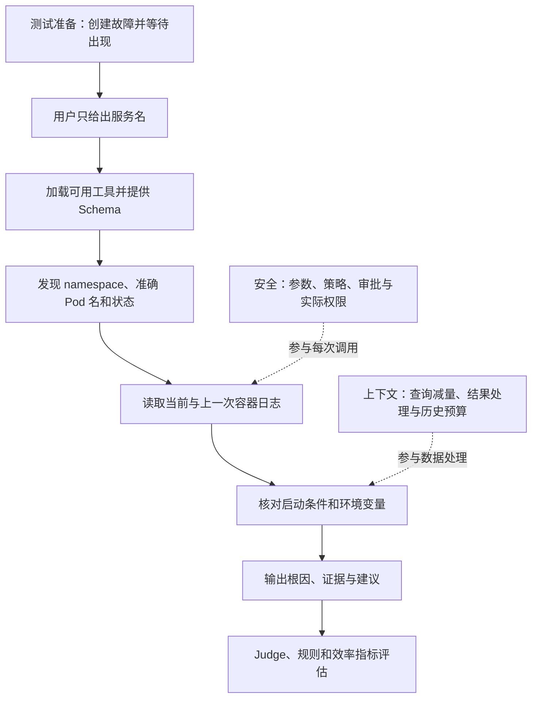

# 用一个支付服务故障理解简历里的四个设计模块

2026-10-06 调整。当前学习主入口：先沿一个已有 case 走完整个调查，再在同一流程里理解工具插件化、分层上下文控制、工具调用安全和效果评估。

**主案例：[09_crashpod](../tests/llm/fixtures/test_ask_holmes/09_crashpod/test_case.yaml)。用户问：`What is the issue with payment-processing-worker?`**

接下来 Day 3–6 都沿用这个服务，每天放大流程中的一部分。每天的成果是能解释“这一步拿到什么、为什么这样做、做错会怎样”，再把它讲成面试回答。

需要实际运行时，使用 [本地环境与运行方法](local-environment.md)。2026-10-06 已用本机 DeepSeek 配置实跑：环境准备、调查、Judge 与清理全部完成，修正 Judge 适配后连续两次 1/1 通过（18.3 秒／10.7 秒、19 次／9 次工具调用）。同一页记录了首次失败的两个原因、Judge 适配、两次数字的波动和未运行的部分。

## 1 先认识故障，不急着打开源码

| 内容 | case 中实际定义的内容 |
| --- | --- |
| 资源 | `app-09` 命名空间里的 Deployment `payment-processing-worker` |
| 容器 | `payment-processing-container`，镜像 `busybox:1.36` |
| 故障构造 | 启动脚本检查 `DEPLOY_ENV`，为空时打印错误并以退出码 1 退出；Deployment 没有配置该变量 |
| 日志证据 | `Environment variable DEPLOY_ENV is undefined` |
| 外部现象 | 容器反复重启，准备阶段等待 Pod 进入 `CrashLoopBackOff` |
| 用户知道什么 | 用户问题只包含服务名，没有命名空间、变量名或根因 |
| 评估要求 | 回答指出 `DEPLOY_ENV` 未定义或缺失；另有 `memories_generated: false`，要求不产生 Skills 建议 |

这里读到根因，是为了理解测试怎样构造故障。真实调查时 Agent 要通过允许访问的数据发现证据；`expected_output` 是评估标准，不会作为答案交给 Agent。

先用一句话解释因果关系：**这个容器的启动逻辑依赖 `DEPLOY_ENV`，配置没有提供它，启动报错后退出，于是出现反复重启。** `CrashLoopBackOff` 是现象，变量缺失是这个 case 的根因。

下面的工具顺序是按 fixture 和当前源码拆解的教学路径，重点是每一步所需的证据与程序职责。2026-10-06 的实测顺序是：先用 `kubernetes_tabular_query` 找到 Deployment 与 Pod，再用 `bash` 尝试 `describe pod` 和查事件（因允许列表与审批分支被拒），然后用 `fetch_pod_logs` 读到启动错误，最后用 `kubernetes_jq_query` 核对 Deployment 的 `env`。路径不唯一，模型也可能先读配置或先读日志；各步实测数字见 [本地环境与运行方法](local-environment.md)。

## 2 先走一次完整调查



安全检查发生在工具调用和数据访问的位置；上下文控制发生在查询、结果处理与下一轮模型请求的位置。它们参与这条调查的多个步骤。

### 第一步：让调查程序具备查询能力——工具插件化

这次要用到两类能力：查询 Kubernetes 资源和读取 Pod 日志。

| 能力 | 当前仓库中的具体例子 | 在本案例里提供什么 |
| --- | --- | --- |
| 资源查询 | `kubernetes/core` 中的 `kubernetes_jq_query` | 找到目标 Pod、状态和 Deployment 配置 |
| 日志查询 | `kubernetes/logs` 中的 `fetch_pod_logs` | 读取目标 Pod 的当前与上一次容器日志 |

加载器读取 YAML 工具定义并构造 Python 工具集，管理层结合启用配置和前置条件准备工具，执行器按名称管理工具对象，再把名称、用途和参数 Schema 提供给模型。模型给出工具名与参数，执行器找到对象，通用 `invoke()` 进入具体实现。

**设计难点：让同一个调查循环调用不同实现，同时保留各数据源的业务语义。** 例如资源查询用 YAML 脚本，当前默认日志工具用 Python 实现，它们都遵循 Tool 接口。新增日志平台可以复用调用流程，但认证、过滤和底层错误仍需该平台实现处理。

核对依据：[加载器](../holmes/plugins/toolsets/__init__.py) 的 `load_builtin_toolsets()`、[执行器](../holmes/core/tools_utils/tool_executor.py) 的 `get_tool_by_name()`、[工具接口](../holmes/core/tools.py) 的 `get_openai_format()` / `invoke()`。先看这三者各自的输入输出，深入学习见 [Day 3](day3/README.md)。

### 第二步：把服务名变成可以查询的资源——发现对象与收窄结果

用户给的是 Deployment 名。日志工具需要准确的 Pod 名；Deployment 创建的 Pod 名带有生成的后缀，不能直接把服务名填入 `pod_name`。

可以用已有 `kubernetes_jq_query` 找候选 Pod。下面是教学参数，尚未执行；Pod 名和重启次数都从实际结果读取：

```json
{
  "kind": "pods",
  "jq_expr": ".items[] | select(.metadata.labels.app == \"payment-processing-worker\") | {namespace: .metadata.namespace, pod: .metadata.name, containers: [.status.containerStatuses[]? | {name, restartCount, state, lastState}]}"
}
```

这条查询只把匹配的资源及调查需要的字段返回给模型。结果应帮助回答：在哪个 namespace？哪个 Pod？哪个容器异常？重启与终止状态是什么？多个候选或没有匹配时，继续核对，不猜命名空间或 Pod 后缀。

**设计难点：返回少，不一定代表数据源查得少。** 当前这个工具分页读取 Kubernetes API，再在本地用 jq 过滤；并没有把上面的标签条件推给服务端。分页控制一页大小，匹配很多时累计结果仍可能很大。它使用跨命名空间集合接口，权限范围也需要支持这种读取；仅有 `app-09` 权限时，可能要使用支持命名空间限定的查询路径。

在支持服务端筛选的查询路径中，可以按 namespace、标签或资源名尽早减量。讲上下文设计时，要说明过滤发生在哪里，以及是否减少传输量、内存占用和最终模型输入。

核对依据：[kubernetes.yaml](../holmes/plugins/toolsets/kubernetes.yaml) 的 API 路径、分页循环和 jq 过滤。不要因为说明里写了分页，就推断总输出一定有界。

### 第三步：取到具体启动错误——调用、安全与日志结果处理

拿到准确 Pod 名后，可以提出以下日志调用。`<上一步返回的准确 Pod 名>` 是待替换位置，不是实际运行值：

```json
{
  "namespace": "app-09",
  "pod_name": "<上一步返回的准确 Pod 名>",
  "limit": 100
}
```

当前默认工具名是 `fetch_pod_logs`。它的 Python 实现读取当前和上一次容器日志，再进行时间、包含/排除条件和数量过滤。上一次容器日志有助于发现已经退出的启动失败；当前容器可能还没有输出。

我们要从日志里发现具体的 `DEPLOY_ENV` 错误。第一次查询不要预先填入自己从标准答案得知的变量名；如果第一批结果没有错误，再依据实际结果调整查询条件。

在这个调用位置同时看三项设计：

| 位置 | 处理什么 | 本例的关键问题 |
| --- | --- | --- |
| 工具入口 | 必填参数、具体类型与业务检查 | 是否填了准确 Pod 名和 namespace？Schema 描述不等于完成所有校验 |
| 数据访问 | 使用实际身份访问 Kubernetes API | 是否具有读取 `pods/log` 的权限？Forbidden 要作为查询失败返回 |
| 结果处理 | 过滤、数量限制、工具内截断，以及后续通用大小控制 | 错误原文是否仍在返回内容里？无匹配与无日志是否区分？ |

**设计难点一：空结果不能直接推出服务正常。** 可能 Pod 名错误、时间范围不合适、过滤过窄，也可能日志读取失败；查看实际错误和返回的查询元信息，才知道该怎么继续。

**设计难点二：参数路径决定安全机制。** 这里的 Python 日志实现以参数数组调用 subprocess，默认没有通过 Shell 解释这些参数。`kubernetes_jq_query` 的 YAML 脚本则要处理 Shell 参数引用；完整 Bash 工具还有独立的 Allow/Deny 与命令结构检查。这几种路径要分别分析。

核对依据：[日志工具参数与内部截断](../holmes/plugins/toolsets/logging_utils/logging_api.py) 的 `PodLoggingTool`、[日志实现](../holmes/plugins/toolsets/kubernetes_logs.py) 的 `_fetch_kubectl_logs()` 和 `filter_logs()`。`USE_LEGACY_KUBERNETES_LOGS` 默认关闭；旧 YAML 的 `kubectl_previous_logs` 可作对照，不能据此称它是当前默认调用。

### 第四步：用配置核对根因，再形成结论

查到错误后，针对 `app-09` 的 Deployment 核对容器启动参数、`env` 和 `envFrom`。本 fixture 没有提供该变量，启动脚本又明确在其为空时退出。日志与配置因此形成一致的解释。

教学结论可以写成：

> `app-09` 的 `payment-processing-worker` 启动失败并反复重启。启动日志报告 `Environment variable DEPLOY_ENV is undefined`；Deployment 的容器配置没有提供这个变量，启动检查失败后以退出码 1 退出。应按应用要求提供正确的 `DEPLOY_ENV`，再验证新容器正常启动。

**设计难点：证据能支持多具体的结论？** 只有 `CrashLoopBackOff` 时，还不知道根因；只有“变量为空”的日志时，真实环境中还可能是空值或配置注入失败，需要继续核对。这个 fixture 能确认缺失，但没有告诉我们正确变量值，不能自行编出一个值，也不能把建议写成已经执行的修复。

### 第五步：如果数据变大，这条调查怎样继续——上下文控制

原 case 没有构造大日志，也没有强制摘要、落盘或 Compaction。现在只改变同一调查的数据规模，理解第二条简历的设计：

| 同场景变化（学习推演） | 处理位置 | 最容易丢掉什么 |
| --- | --- | --- |
| 集群资源很多，只调查这个服务 | 查询时按对象和字段减量 | 对象选错，或误认为本地过滤已经减少 API 读取 |
| 支付服务有大量日志，启动错误在较早位置 | 工具内过滤/limit/截断；按配置进行 Transformer；通用单次结果大小控制 | 截断掉具体错误，或摘要只剩“启动异常” |
| 多轮查事件、日志和配置，累计历史很长 | 下一轮请求前检查历史、工具 Schema 和输出预算，必要时 Compaction | 丢掉 namespace、错误原文、已验证结论和下一步 |

当前日志工具会按 token 预算截掉较早内容；通用落盘收到的是**工具已经处理后的结果**，不能恢复工具内过滤、截断或摘要丢掉的原文。因此首先要选择合适的查询范围，并看截断提示；缺少启动证据时重新查询仍可访问的日志。

`llm_summarize` 是保留的历史机制，默认关闭且不推荐；需要配置摘要模型并满足条件才会执行。当前通用大结果机制优先落盘，在历史中放路径和预览；整体历史再按预算考虑 Compaction。摘要、落盘和历史压缩各有作用，实际经过哪些分支要看配置与运行记录。

核对依据：[单次结果落盘](../holmes/core/tools_utils/tool_context_window_limiter.py)、[历史预算检查](../holmes/core/truncation/input_context_window_limiter.py)。深入学习见 [Day 4](day4/README.md)。

### 第六步：如果日志访问需要审批，怎样恢复——工具调用安全

原 case 没有设置强制审批。继续沿用这次日志调用，假设配置 `approval_required_tools: ["fetch_pod_logs"]`，并且当前入口支持审批交互：

```text
提出读取 app-09 某个 Pod 日志的调用
→ Tool.invoke 检查到需要审批，返回 APPROVAL_REQUIRED
→ 调查层保存待审批调用，签发与内容绑定的 Token
→ 人同意这次读取，恢复请求携带原调用和 Token
→ 校验签名、有效期、调用 ID、工具名和参数哈希
→ 校验通过后恢复执行，访问 API 时仍受 RBAC 约束
```

把 namespace 从 `app-09` 改成 `prod`，已有 Token 的参数哈希就不能匹配；单独说“已批准”无法替代这项验证。没有可用审批交互时，普通调用会得到拒绝结果。原始未获批的 Bash 路径中，命令策略拒绝与待审批也是两种不同结果。

**设计难点：每层约束的对象不同。** RBAC 决定数据访问权限，Shell 参数处理保护模板执行语义，完整 Bash 策略决定命令能否进入执行，审批提供人的决定，Token 将恢复与批准的内容绑定。审批不能增加集群权限，Token 的内容绑定也不能代替身份认证或完整的单次使用控制。

核对依据：[审批配置与入口](../holmes/core/tools.py) 的 `_check_approval_config()` / `invoke()`、[Token](../holmes/utils/approval_tokens.py)、[恢复逻辑](../holmes/core/tool_calling_llm.py) 的 `_execute_tool_decisions()`。深入学习见 [Day 5](day5/README.md)。

### 第七步：怎样知道这次调查做得好——效果评估

eval 先创建上述故障并等待 `CrashLoopBackOff`，再运行 Agent，最后把输出交给 correctness Judge，检查是否表达了 `DEPLOY_ENV` 未定义或缺失。`memories_generated: false` 另行约束这次常规调查不生成 Skills 建议。准备与清理脚本属于测试环境管理，不是 Agent 自动执行的修复。

| 教学回答/行为 | 应怎样分析 |
| --- | --- |
| 只说 `CrashLoopBackOff` | 没有满足具体根因要求 |
| 指出 `DEPLOY_ENV` 缺失 | 满足语义根因要求，仍需核对调查证据 |
| 根因答对，却完全没有查询证据 | 现有语义标准可能给高分；要检查 Trace 或增加过程验证 |
| 准备阶段没有成功制造故障 | 是环境准备失败，应与调查失败分开统计 |
| 有很多重复查询才答对 | 正确性达标，还要分析耗时、调用次数和用量 |

**设计难点：结果正确性与过程可信度分别怎么验证？** Judge 适合判断不同措辞是否表达了已知根因，程序断言适合检查确定性行为。harness 提供禁止工具、Token 上限等断言，但本 case 没有配置这些字段。`include_tool_calls` 可把调用信息提供给 Judge，本身不构成“必须查询”的硬断言。可以提出检查实际证据的改进方案，不能把它说成原 case 已经具备的保证。

效率指标记录 Agent 调查耗时、模型与工具调用次数、Token 和费用。`holmes_duration` 包围 `ai.call()`，不包含后续 Judge 时间。比较改动前后时固定 case、工具权限与评价标准，重复运行，并查看具体失败原因。

核对依据：[Judge](../tests/llm/utils/classifiers.py) 的 `evaluate_correctness()`、[评审输入](../tests/llm/utils/property_manager.py) 的 `update_test_results()`、[评测入口](../tests/llm/test_ask_holmes.py)。深入学习见 [Day 6](day6/README.md)。

## 3 Day 3–6 怎么安排

先用 20 分钟读本页前四步，能复述因果与证据后再进入当天文档。每天保留约 90 分钟核心练习：沿案例理解 50 分钟，口述和查证 40 分钟；源码每次只核对一个疑问。

Day 3–6 都已改写成讲义：需要读的源码片段按调用顺序摘录在正文里，每段标了 `文件:行号`，读的时候不必再打开源码。

| 当天 | 放大哪段流程 | 当天要能解释的设计难点 | 打开哪里 |
| --- | --- | --- | --- |
| Day 3 | 工具加载 → 资源发现 → 日志调用 | Deployment 与 Pod 名的区别；统一接口如何承载 YAML/Python 实现；查询失败如何返回 | [工具插件化](day3/README.md) |
| Day 4 | 资源/日志结果 → 下一轮请求 | 本地过滤、工具内截断、摘要、落盘和历史压缩怎样影响 `DEPLOY_ENV` 证据 | [上下文控制](day4/README.md) |
| Day 5 | 同一次工具调用的检查与恢复 | Python 参数数组、YAML Shell 引用、Bash 策略与 RBAC 分工；批准内容如何绑定 | [调用安全](day5/README.md) |
| Day 6 | 故障准备 → 调查 → Judge/规则 → 报告 | 根因正确与证据充分怎样区分；通过率和效率指标怎样解释 | [效果评估](day6/README.md) |

本页负责完整故事，各天负责局部解释。已有 Day 1/2 Trace 保留作参考，但它们不是这个 Kubernetes case 的运行证据。

## 4 学完后，用一个故事讲四条简历

参考讲述，个人贡献按实际经历补充：

> 我用支付处理服务反复重启这个测试场景理解项目设计。用户只给了服务名，Agent 先通过统一 Tool/Toolset 接口发现准确的 Pod 和状态，再调用日志工具，结合 Deployment 配置确认缺少 DEPLOY_ENV 导致启动退出。这个过程里的困难是把多种数据源接入同一个调用框架，并在大结果和长历史中保住具体错误证据；查询减量、单次结果处理和历史 Compaction 分别解决不同位置的问题。工具执行还要区分参数处理、Bash 策略、实际 RBAC 和人工审批，恢复审批时用签名 Token 绑定原调用。最后通过可复现故障与预期根因评估语义正确性，结合规则和 Trace 核对行为，并统计调查耗时、调用次数和用量。原 case 没有强制触发摘要或审批，我会用同一场景的变化解释这些分支，再按实际运行验证。

验收时沿流程问自己五个问题：

1. 只有服务名，怎样找到准确 Pod？每一步拿到什么信息？
2. 为什么 `CrashLoopBackOff` 不够？哪些日志和配置支持具体根因？
3. 错误日志被过滤、截断或压缩丢掉时，哪一层能处理，哪一层无法恢复？
4. 同一次日志调用，权限不足、策略拒绝和等待审批分别在哪里发生？
5. 答对变量名能证明什么？还需要怎样验证证据、稳定性和成本？

学习记录仍写在各天 README 文末。如果卡住，直接说：“带我沿 09_crashpod 学到第几步，先解释这一步的输入输出和设计难点，再用我的回答检查理解。”
