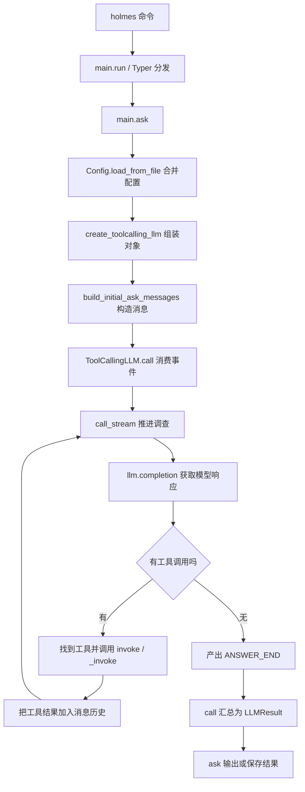

# 面向 HolmesGPT 源码阅读的 Python 零基础讲义

这份讲义的目标是：当你打开 HolmesGPT 的 Python 文件时，能够看清一个函数接收什么、做了什么、返回什么，以及它与其他模块怎样配合。

不要求你事先学过其他编程语言。每个概念先用小例子解释，再连接到项目里的真实写法。读完后，你应该能沿着“命令入口 → 配置 → 模型调用 → 工具执行 → 结果返回”的路线阅读，而不必每行都查语法。

**适用基线：**2026-09-28 的本地工作区。项目的 [pyproject.toml](/Users/weibo/Project/holmesgpt/pyproject.toml:12) 声明 Python `>=3.10,<3.14`，使用 Pydantic 2；本次验证使用项目虚拟环境中的 Python 3.12。源码会变化，因此找代码时优先搜索函数或类名，行号只是辅助。

文中有三类代码：**可运行小例子**可以独立尝试；**源码摘录**取自当前项目，通常需要所在模块的上下文；**教学简化**保留关键结构，省略了生产代码的分支，不是实际实现的替代品。配套的 [examples.py](/Users/weibo/Project/holmesgpt/study/python-basics/examples.py) 汇总了一组离线练习。

## 阅读路线与目录

建议分 5 次学习，每次 60～90 分钟；初次接触编程时可以再拆分。时间只是安排建议，以能解释例子为准。

| 次序 | 阅读内容 | 本次完成的标志 |
| --- | --- | --- |
| 第 1 次 | 第 0～4 节：执行、数据、条件、循环 | 能手算一个列表经过循环后的结果 |
| 第 2 次 | 第 5～7 节：函数、类型、模块 | 能解释 `Optional`、`**kwargs` 和导入路径 |
| 第 3 次 | 第 8～10 节：类、装饰器、Pydantic | 能读懂配置类和 `StructuredToolResult` |
| 第 4 次 | 第 11～14 节：异常、文件、生成器、测试 | 能说清 `return`、`yield`、`await` 的区别 |
| 第 5 次 | 第 15～18 节：真实源码、练习、阅读地图 | 能独立追踪一次工具执行的数据流 |

- [0. 先知道程序怎样运行](#lesson-0)
- [1. 看懂一小段 Python](#lesson-1)
- [2. 值、变量和字符串](#lesson-2)
- [3. 列表、字典、元组与集合](#lesson-3)
- [4. 条件、循环与推导式](#lesson-4)
- [5. 函数、参数与作用域](#lesson-5)
- [6. 类型标注的阅读方法](#lesson-6)
- [7. 模块、导入与程序入口](#lesson-7)
- [8. 类、对象、继承与方法](#lesson-8)
- [9. 装饰器、回调与 dataclass](#lesson-9)
- [10. Pydantic：读懂项目的数据模型](#lesson-10)
- [11. 异常、日志与上下文管理](#lesson-11)
- [12. 文件、环境变量、JSON 与 HTTP](#lesson-12)
- [13. yield、流式事件与并发](#lesson-13)
- [14. 从测试反推函数的行为](#lesson-14)
- [15. 带读真实源码与 Agent 主链路](#lesson-15)
- [16. 离线练习与答案](#lesson-16)
- [17. 源码阅读顺序与自测标准](#lesson-17)
- [18. 随手查阅的语法表与术语表](#lesson-18)

<a id="lesson-0"></a>

## 0. 先知道程序怎样运行

### 0.1 文件、解释器、依赖、虚拟环境

Python 源码通常放在 `.py` 文件里。**解释器**是执行这些文件的程序。你写下 `print("你好")`，解释器执行它，终端才会显示“你好”。

项目还会使用别人写好的代码包，称为**依赖**，例如 Pydantic、Typer、requests。**虚拟环境**为一个项目准备独立的解释器与依赖，避免多个项目互相影响。这个项目用 **Poetry** 管理依赖和虚拟环境。

| 看到的东西 | 应怎样理解 |
| --- | --- |
| `holmes/main.py` | 存储 Python 源码的文件 |
| `python` | 执行源码的解释器命令 |
| `pyproject.toml` | 项目配置、依赖要求、命令入口 |
| `poetry.lock` | 锁定解析出的依赖版本，帮助重现环境 |
| `poetry run ...` | 在这个项目的环境里执行后面的命令 |

当前电脑的系统 `python3` 与项目环境不是同一个版本。**本讲义的运行命令统一使用 `poetry run python`。** 不必为阅读讲义重新安装依赖或重建环境。

### 0.2 开始一个小实验

在终端中执行，注意这是终端命令，不是 Python 代码：

```bash
cd /Users/weibo/Project/holmesgpt
poetry run python --version
poetry run python -c 'print("你好，Python")'
```

`-c` 表示执行后面引号里的 Python 代码。最后一行输出：

```text
你好，Python
```

也可以输入 `poetry run python` 进入交互式解释器，看到 `>>>` 后逐行输入表达式。`>>>` 是提示符，不是代码的一部分；输入 `exit()` 退出。

配套练习的运行方式是：

```bash
poetry run python study/python-basics/examples.py
```

它只使用本地数据和项目已有的 Pydantic，逐项打印结果并检查预期行为。

### 0.3 阅读时总是找这四样东西

1. **输入**：数据从参数、文件、环境变量还是另一个对象来？
2. **处理**：经过哪些判断、循环和函数调用？
3. **输出**：返回的是字符串、字典、对象，还是持续产生的事件？
4. **外部影响**：是否改了传入的列表、写了文件或发送了网络请求？

“调用完返回了什么”与“调用过程中改变了什么”是两个不同的问题。后面会反复使用这四个问题。

<a id="lesson-1"></a>

## 1. 看懂一小段 Python

**可运行小例子：**

```python
def describe_status(status):
    """把状态翻译成中文。"""
    if status == "success":
        return "执行成功"
    return "尚未成功"


message = describe_status("success")
print(message)
```

按执行顺序读：

1. `def` 定义一个名叫 `describe_status` 的函数，暂时不执行函数内部的判断。
2. `describe_status("success")` 调用它，把字符串 `"success"` 交给参数 `status`。
3. `if` 判断是否相等；相等就进入更深一层缩进的代码。
4. `return` 将 `"执行成功"` 交回调用处，同时结束这次函数执行。
5. `message = ...` 把返回值交给变量 `message`。
6. `print(message)` 显示结果。

**缩进就是程序结构。** 通常每层 4 个空格。同一层缩进属于同一层代码；冒号 `:` 后常常接一个缩进块。`def`、`if`、`for`、`class`、`try` 都会这样使用冒号。

```python
if True:
    print("在判断里面")
print("在判断外面")
```

其他阅读规则：

- `# 后面的文字` 是注释，不参与执行。
- 函数或类开头的三引号字符串通常是**文档字符串**，用于说明用途。
- **括号 `()`、方括号 `[]`、花括号 `{}` 中的表达式可以换行，仍然是一条语句。**
- 尾部多一个逗号很常见，便于后续增删项目。
- 名字区分大小写：`Config` 与 `config` 是不同名字。

**暂停自测：**如果传入 `"error"`，函数返回什么？答案是 `"尚未成功"`，因为第一个 `return` 所在的分支没有执行。

<a id="lesson-2"></a>

## 2. 值、变量和字符串

### 2.1 常见的值

| 类型 | 例子 | 项目里的典型用途 |
| --- | --- | --- |
| `str`，字符串 | `"success"`、`"你好"` | 问题、日志、工具名、JSON 文本 |
| `int`，整数 | `10`、`0`、`-1` | 最大步数、记录数量 |
| `float`，浮点数 | `0.25` | 耗时、费用 |
| `bool`，布尔值 | `True`、`False` | 是否开启某个功能 |
| `None` | `None` | 当前没有提供值或没有结果 |

`None` 不是字符串 `"None"`，也不等于空字符串 `""`。字符串 `"False"` 不是布尔值 `False`。

```python
max_steps = 10
max_steps = max_steps + 1
print(max_steps)  # 11
```

`=` 表示赋值，`==` 才是判断相等。可以把变量理解为“对象的名字”：右边先计算出结果，再让左边的名字指向它。变量的类型不由名字决定，`"10"` 是字符串，`10` 才是整数。

```python
print(int("10") + 2)  # 12
print(str(10) + "次")  # 10次
```

`int("abc")` 不能转换，会抛出异常；异常的处理见第 11 节。

### 2.2 字符串写法

单引号和双引号都能表示字符串；选择方便的一种即可。

```python
tool_name = "get_logs"
count = 3
message = f"工具 {tool_name} 返回 {count} 条记录"
print(message)
```

输出：`工具 get_logs 返回 3 条记录`。

前缀 `f` 表示 **f-string**：花括号里的表达式会计算，并把结果放进字符串。

| 写法 | 含义 |
| --- | --- |
| `f"{elapsed:.2f}"` | 小数保留两位，例如 `1.20`  **注：**这里  `elapsed` 填写具体的数字，下面一样的意思 |
| `f"{count:,}"` | 加千位分隔符，例如 `12,345` |
| `f"{value!r}"` | 使用适合调试的表示，便于看出引号与转义符 **注：**把变量原本的样子表示出来 |
| `"第一行\n第二行"` | `\n` 是换行符 |
| `r"\d+"` | 原始字符串，常用于正则表达式，保留反斜杠含义 |

`r"..."` 不是正则表达式引擎，只是一种字符串写法；交给 `re` 模块后才按正则规则解释。

常见字符串操作：

```python
name = "  holmes  "
print(name.strip())            # holmes   		         	删除字符串多余空格
print("ERROR".lower())         # error  							 	大写转换为小写 
print("a,b,c".split(","))      # ['a', 'b', 'c']			 	用','来分割字符串
print(", ".join(["a", "b"]))  # a, b									 	给两个字符串直接添加', '
print("log.txt".endswith(".txt"))  # True 						 	后缀匹配
print("builtin://ask".startswith("builtin://"))  # True	前缀匹配
```

**字符串不可原地修改**，`strip()` 等方法返回新字符串。**单独执行 `name.strip()` 不会改变变量 `name` 指向的原字符串。**

### 2.3 常见运算符

`+` 加法或连接，`-` 减法，`*` 乘法，`/` 除法，**`//` 向下取整除法**，`%` 取余，`**` 乘方。`+=` 常用来更新计数，例如 `i += 1`。注意：后面还会看到 `**config`，其中 `**` 是解包，含义由出现的位置决定。

比较运算有 `==`、`!=`、`<`、`<=`、`>`、`>=`；结果通常是 `True` 或 `False`。

<a id="lesson-3"></a>

## 3. 列表、字典、元组与集合

项目的大部分数据都可以理解为“若干个元素”或“若干个有名字的字段”。先掌握下面四种容器。

### 3.1 列表 list：按顺序放元素

```python
messages = ["system", "user"]
messages.append("assistant")
print(messages[0])   # system
print(messages[-1])  # assistant
print(len(messages))  # 3
# 下方补充一个 extend 的使用例子
a = [1, 2, 3]
a.extend([4, 5])    # [1, 2, 3, 4, 5]      → 把里面的元素"拆开"逐个加入
```

下标从 `0` 开始，`-1` 表示最后一个元素。`append` 增加一个元素；`extend` 把另一组元素逐个加入。

```python
numbers = [10, 20, 30, 40]
print(numbers[1:3])  # [20, 30]
print(numbers[:2])   # [10, 20]
print(numbers[2:])   # [30, 40]
```

切片 `[起点:终点]` **包含起点、不包含终点**。越界取单个元素会抛 `IndexError`，切片的边界则可以超出范围。

容易踩坑：**`append()` 原地修改列表，返回 `None`**。不要写 `messages = messages.append("tool")`，否则 `messages` 最后会变成 `None`。

### 3.2 字典 dict：按名字放字段

从下面的case可以看出来字典 按 `key` 获取 `value` 的手段可以认为**有两种**。分别是 `message[]` 和 `get()` 方法

```python
message = {"role": "user", "content": "查看服务状态"}
print(message["role"])              # user  
print(message.get("tool_calls"))     # None
print(message.get("tool_calls", [])) # []
message["content"] = "查看最近的日志"
```

字典的每一项是“键: 值”。`message["role"]` 用键取值；**键不存在时抛 `KeyError`**。`.get()` 可以提供缺少键时的默认值。

**默认值只在键不存在时生效：**

```python
config = {"timeout": None}
print(config.get("timeout", 30))  # None，不是 30
```

常见操作：

```python
config = {"max_steps": 5, "enabled": True}
config.update({"max_steps": 10})
print(config["max_steps"])  # 10
print("enabled" in config)  # True，判断键是否存在

for key, value in config.items():
    print(key, value)
```

`.keys()` 看键，`.values()` 看值，`.items()` 看键值对。`.update()` 会修改原字典，同名键以传入的值为准。

### 3.3 读懂嵌套数据

HolmesGPT 的对话历史经常是“列表中装字典”：

```python
messages = [
    {"role": "system", "content": "你是排障助手"},
    {"role": "user", "content": "服务为什么变慢？"},
]
print(messages[1]["content"])  # 服务为什么变慢？
```

从左往右拆开：先取 `messages` 的第 2 个元素，得到一个字典，再取字典的 `"content"`。

以后遇到 `response.choices[0].message` 也用同样办法：先取对象属性 `choices`，再取列表第一个元素，再取它的 `message` 属性。

### 3.4 元组 tuple：常用来组合返回值

```python
result = (True, "连接正常")
success, reason = result
print(success)  # True
print(reason)   # 连接正常
```

这叫**解包**：把两个元素分别交给两个变量。项目里经常返回 `(是否成功, 说明文字)`。

`return True, "连接正常"` 返回的是一个含两个元素的元组，不是两次返回。元组的元素位置不能修改，但其内部如果放了列表，那个列表仍可能被修改。

`data, _ = result` 中的 `_` 仍然是普通变量，只是约定表示“这个值暂时不用”。**单元素元组写成 `(value,)`**，逗号不能省略。

### 3.5 集合 set：去重和判断成员

```python
names = {"logs", "metrics", "logs"}
print(len(names))          # 2
print("logs" in names)     # True
```

集合不提供列表那样的位置下标，不要依赖它的输出顺序。**空集合写 `set()`**，因为 `{}` 是空字典。`frozenset` 是不能增删元素的集合，项目会用它构造可比较的工具签名。

### 3.6 必须掌握：赋值不是复制

```python
original = [{"role": "user", "content": "旧问题"}]
same = original
same.append({"role": "assistant", "content": "回答"})
print(len(original))  # 2，两者指向同一个列表

copied = list(original)
copied.append({"role": "tool", "content": "工具结果"})
print(len(original))  # 仍是 2，最外层列表已复制

copied[0]["content"] = "新问题"
print(original[0]["content"])  # 新问题，内部的字典仍共享
```

`list(original)`、`original.copy()`、`dict(original_dict)` 通常都是**浅复制**：只复制最外层容器。需要连嵌套对象一起复制时，可研究标准库的 `copy.deepcopy()`。

这对阅读 `messages.append(...)`、`params[...] = ...` 很重要：它们可能影响调用方持有的数据。

<a id="lesson-4"></a>

## 4. 条件、循环与推导式

### 4.1 条件与真假值

```python
status = "error"
if status == "success":
    print("继续")
elif status == "error":
    print("处理错误")
else:
    print("其他情况")
```

`elif` 是“否则，如果”。一次判断链只执行第一个成立的分支。

在条件里，**以下常见值被当作假：`None`、`False`、数字 `0`、`""`、`[]`、`{}`、`set()`**。非空字符串通常为真，因此 `bool("false")` 和 `bool("0")` 都是 `True`。

```python
if messages:
    print("列表中有消息")

if model is not None:
    print("提供了值，即使这个值可能是空字符串")
```

`if x` 是判断真假，`if x is not None` 专门判断是否为 `None`。如果 `0` 或空列表也是合法输入，不能随意把这两种判断互换。

`==` 比较值是否相等，`is` 比较是不是同一个对象。判断 `None` 用 `is None`；比较工具名等字符串的内容用 `==`。

### 4.2 and、or、not 与短路

Python里的 `and` 和 `or` 的含义和别的语言不太一样：

- `or` 找**第一个真值**，找不到就返回最后一个值。

- `and` 找**第一个假值**，找不到就返回最后一个值。

```python
if config is not None and config.get("enabled"):
    print("已启用")
```

`and` 左侧为假时，右侧不执行，因此 `config` 为 `None` 时不会调用 `.get()`。`or` 左侧为真时，也不会执行右侧。

**`and` 和 `or` 返回的是某个操作数，未必是布尔值：**

```python
model = "" or "默认模型"      # 默认模型
timeout = 0 or 30           # 30
value = None or {}          # {}
```

项目中的 `model or config.model or ""`，就是依次选择第一个真值；`params or {}` 常用于把 `None` 转成可用字典，也会替换掉空字典。

### 4.3 for、while 与退出

```python
tools = ["logs", "metrics"]
for index, name in enumerate(tools, start=1):
    print(index, name)
```

`enumerate` 同时提供编号和元素；普通 `for name in tools` 只提供元素。`range(3)` 依次给出 `0, 1, 2`。

```python
step = 0
while step < 3:
    step += 1
    print(step)
```

`while` 在条件成立时反复执行。读循环时先找**推进条件与退出位置**，再看细节。

| 语句 | 控制作用 |
| --- | --- |
| `continue` | 跳过本轮余下代码，进入下一轮 |
| `break` | 结束当前这一层循环，继续执行循环后面的代码 |
| `return value` | 结束当前整个函数，并交回结果 |
| `pass` | 不做任何操作，不会退出循环或函数 |

`while True` 没有条件上的上限，要进一步找 `break`、`return` 或异常。**循环有时带 `else`：它在循环正常结束、没有经由 `break` 退出时执行**，阅读时不要把它误认成附近 `if` 的分支。

### 4.4 推导式：把常见循环写紧凑

```python
tools = ["logs", "metrics", "events"]
short_names = [name for name in tools if len(name) <= 4]
print(short_names)  # ['logs']
```

等价展开：

```python
short_names = []
for name in tools:
    if len(name) <= 4:
        short_names.append(name)
```

读法是：**从哪里取 → 是否保留 → 结果变成什么**。字典推导式也一样。

下面是 [Config.load_from_file](/Users/weibo/Project/holmesgpt/holmes/config.py:274) 中的真实写法：

```python
cli_options = {k: v for k, v in kwargs.items() if v is not None and v != []}
```

它保留不是 `None`、也不是空列表的命令行选项。`False`、`0`、`""` 都会保留！如果误读成“删除所有假值”，就会理解错配置合并行为。

还有条件表达式：

```python
label = "成功" if success else "失败"
```

这是一个表达式，根据条件选择一个值。它与推导式末尾负责筛选元素的 `if` 不同。

看到 `(item for item in items)` 时，圆括号通常构成生成器表达式，元素按需产生，见第 13 节**。`any(...)` 判断是否至少有一个真值，`all(...)` 判断是否全是真值**；空序列的 `any` 为假，`all` 为真。

<a id="lesson-5"></a>

## 5. 函数、参数与作用域

### 5.1 按四部分读函数签名

```python
def format_result(name: str, count: int = 0) -> str:
    return f"{name}: {count} 条"
```

| 部分 | 含义 |
| --- | --- |
| `format_result` | 函数名 |
| `name: str` | 参数名 `name`，期望是字符串 |
| `count: int = 0` | 参数名 `count`，期望是整数，省略时取 0 |
| `-> str` | 期望返回字符串 |

冒号后的 `str`、`int` 和箭头后的 `str` 是**类型标注**。先把这些标注遮住，剩下的仍是普通函数。

```python
format_result("logs", 3)               # 位置参数
format_result(name="logs", count=3)    # 关键字参数
format_result("logs", count=3)         # 混合使用
format_result("logs")                  # 使用 count 的默认值
```

位置参数靠顺序对应，关键字参数靠名字对应。不能给同一个参数赋值两次。一般写法中，位置参数放在关键字参数之前。

### 5.2 return 与 print 完全不同

`print` 把信息显示出来；`return` 把值交给调用方。函数执行到末尾没有 `return`，或只写了 `return`，返回值都是 `None`。

```python
def display_name(name):
    print(name)


value = display_name("holmes")  # 屏幕显示 holmes
print(value)                    # None
```

### 5.3 *args、**kwargs 与解包

在函数定义里，它们用于**收集**参数：

```python
def inspect_arguments(*args, **kwargs):
    return args, kwargs


print(inspect_arguments("logs", "metrics", limit=3, enabled=True))
# (('logs', 'metrics'), {'limit': 3, 'enabled': True})
```

`args` 得到元组，`kwargs` 得到字典；名字本身可以换，特殊含义来自 `*` 与 `**`。

在调用位置，它们用于**展开**参数：

```python
values = ["logs", 3]
print(format_result(*values))

options = {"name": "logs", "count": 3}
print(format_result(**options)) # **解包字典的时候，每个元素是 键=值 的结构
```

`format_result(**options)` 相当于 `format_result(name="logs", count=3)`。调用时 `**` 展开的键须为合法的字符串关键字，并且能被被调用方接收。

项目的 `ServiceNowTablesConfig(**config)` 就是把配置字典展开，交给配置类创建对象。

字典合并也会用 `**`：`{**base, **override}` 创建一个新字典，右边同名键覆盖左边；这是容器里的合并，不是函数调用。列表里的 `[*left, *right]` 则把两组元素展开到一个新列表。

### 5.4 只允许用名字传入的参数

```python
def search(query: str, *, limit: int = 10):
    return query, limit
```

星号后面的 `limit` 必须写成 `search("error", limit=5)`，不能写成 `search("error", 5)`。若看到签名中有 `/`，则其前面的参数要求按位置传入。初读时记住它们在限制调用方式即可。

### 5.5 默认参数的一个重要陷阱

普通 Python 函数的默认值在**执行函数定义时**计算一次，不是每次调用都重新创建。

```python
def add_message(message, messages=None):
    if messages is None:
        messages = []
    messages.append(message)
    return messages
```

这种写法让每次省略参数时都有一个新的列表。若写成 `messages=[]` 并修改它，多次调用可能共享同一个默认列表。这个规则要与 Pydantic 模型字段的处理区分，见第 10 节。

### 5.6 局部变量、修改对象与回调

函数内赋值的名字通常是**局部变量**，调用结束后不能直接从外面使用。函数能读取外层作用域的名字，但给一个同名局部变量重新赋值，并不会自动修改外层变量。

不过，函数收到的是对象的引用。执行 `messages.append(...)` 会修改那个列表；执行 `messages = []` 只是让局部名字指向另一个列表。

函数也是值，可以存进变量、传给别的函数：

```python
def announce(text):
    print(f"进度：{text}")


callback = announce
callback("加载完成")
```

`announce` 是函数本身，`announce("加载完成")` 是立即调用的结果。项目中的 `on_event=init_renderer.on_event` 把方法交出去，后续有事件时再调用，这就叫**回调**。

`lambda item: item["name"]` 是一个短小匿名函数，等价于接收 `item` 并返回 `item["name"]` 的普通函数。常用于 `sorted(items, key=lambda item: item["name"])`。

<a id="lesson-6"></a>

## 6. 类型标注的阅读方法

类型标注像数据地图，能帮你预判后面应该使用下标、键还是点号。Python 普通函数**不会仅因为写了标注就在运行时强制检查参数**；Pydantic 等框架会读取标注并实施自己的校验。

### 6.1 常用类型对照表

| 类型写法 | 阅读方式 |
| --- | --- |
| `str`、`int`、`bool` | 字符串、整数、布尔值 |
| `list[str]` / `List[str]` | 元素为字符串的列表 |
| `dict[str, Any]` / `Dict[str, Any]` | 键为字符串、值暂不限定的字典 |
| `tuple[bool, str]` / `Tuple[bool, str]` | 两个元素，依次为布尔值和字符串 |
| `Optional[str]` / `str \| None` | 字符串或 `None` |
| `Union[str, int]` / `str \| int` | 字符串或整数 |
| `Any` | 允许任意类型；阅读时仍要追踪真实值 |
| `Callable[[str], bool]` | 接收字符串、返回布尔值的可调用对象 |
| `Type[Config]` / `type[Config]` | `Config` 类或其子类本身，而非实例 |
| `ClassVar[int]` | 类级别的信息，不是普通的实例数据字段 |
| `Generator[Event, None, None]` | 逐步产生 Event；不接收有意义的 send 值，结束时不返回其他结果 |
| `Iterable[str]` | 能逐项遍历字符串的对象，不保证是列表，也不保证能重复遍历 |
| `Annotated[str, ...]` | 字符串类型，附带框架可读取的元数据 |

大写的 `List`、`Dict` 等来自 `typing`，小写的 `list`、`dict` 是内置类型；在这里表达相似的容器类型约束。仓库同时存在两种写法，阅读时不必纠结风格差异。

### 6.2 Optional 不等于“可以省略”

```python
def first(value: str | None):
    return value


def second(value: str | None = None):
    return value
```

`first(None)` 合法，但 `first()` 缺少必需参数；`second()` 可以省略参数。**是否允许 `None` 看类型，是否允许省略看默认值。** Pydantic 2 的必填字段也要这样区分。

### 6.3 逐层拆一个项目签名

教学简化，参照 `Config.create_toolcalling_llm`：

```python
def create_toolcalling_llm(
    self,
    toolset_tag_filter: Optional[List[ToolsetTag]] = None,
    on_event: EventCallback = None,
) -> "ToolCallingLLM":
    ...
```

可以翻译成：“这个对象有一个创建 Agent 对象的方法；它可以接收工具集标签列表，也允许不提供；可以接收进度回调；返回 `ToolCallingLLM` 实例。”

引号里的 `"ToolCallingLLM"` 是**前向类型引用**，仍然在说明对象类型，不是在说返回字符串。它常用来避免某个类尚未定义或类型引用带来的导入依赖。

项目的 [EventCallback](/Users/weibo/Project/holmesgpt/holmes/core/init_event.py:43) 实际上是：

```python
EventCallback = Optional[Callable[[StatusEvent], None]]
```

它是类型别名：可以是一个接收 `StatusEvent`、返回 `None` 的回调，也可以完全不传。

### 6.4 类型辅助写法，不要误认为业务逻辑

- `isinstance(value, str)`：运行时真的检查对象是否属于某种类型（也包括子类实例）。
- `cast(ServiceNowTablesConfig, self.config)`：给类型检查器提示，运行时返回原对象，**不会转换或校验它**。
- `# type: ignore`：让类型检查器忽略相关诊断，不会屏蔽运行时异常。
- `if TYPE_CHECKING:`：普通运行时该条件为假；里面的导入主要供静态分析使用。
- `from __future__ import annotations`：改变注解求值方式，阅读时仍按类型说明理解。

**暂停自测：**`Optional[List[Dict[str, str]]]` 是什么？答案：要么 `None`，要么一个列表，列表的每项是“字符串键 → 字符串值”的字典。

<a id="lesson-7"></a>

## 7. 模块、导入与程序入口

### 7.1 一个 .py 文件通常是一个模块

```python
import json
from pathlib import Path
from holmes.core.tools import StructuredToolResult
```

它们分别表示：

- 导入 `json` 模块，通过 `json.loads(...)` 使用它的函数。
- 从标准库 `pathlib` 中导入 `Path`，可以直接写 `Path(...)`。
- 从项目的 `holmes/core/tools.py` 模块中导入 `StructuredToolResult`。

**包**用于组织模块。传统的包目录通常有 `__init__.py`，但 Python 也支持没有这个文件的命名空间包。这里先按项目实际目录理解就好。

`from .utils import helper` 中的点表示相对当前包导入；`import ... as short_name` 是给导入对象起别名。模块名和安装包名有时不同，不要只凭名字猜依赖来源。

### 7.2 import 不只是复制几行文字

普通首次导入时，Python 会执行模块的顶层代码，建立函数、类等对象；同一进程后续通常复用已加载的模块。函数体不会因为定义被读取就自动执行，但函数默认值表达式、装饰器、类体等可能在定义时执行。

因此看到：

```python
MAX_STEPS = int(os.environ.get("MAX_STEPS", "10"))
```

若它位于模块顶层，值通常是在导入时确定的，不会随着环境变量变化自动更新。若同一行位于函数体内，则在调用走到这行时读取。

### 7.3 `__name__`、`__file__` 与主入口

```python
if __name__ == "__main__":
    run()
```

一个模块作为当前程序入口执行时，`__name__` 为 `"__main__"`；作为普通模块导入时，通常是模块名。这个判断让“定义可供导入的函数”与“主动启动程序”分开。

`__file__` 通常指当前模块文件的位置。项目的 Prompt 加载器借此寻找与代码放在一起的模板文件。`__name__` 也常用于 `logging.getLogger(__name__)`，为日志标注来源模块。

项目在 [pyproject.toml](/Users/weibo/Project/holmesgpt/pyproject.toml:9) 中注册了命令：

```toml
[tool.poetry.scripts]
holmes = "holmes.main:run"
```

这是 TOML，不是 Python。它告诉打包工具：安装出的 `holmes` 命令调用 `holmes.main` 模块里的 `run` 函数。概念上相当于：

```python
from holmes.main import run

run()
```

这里的代码会启动应用，不属于离线练习。

### 7.4 分清三个层面

| 层面 | 例子 | 理解重点 |
| --- | --- | --- |
| Python 语言和标准库 | `for`、`class`、`json`、`pathlib` | 语法与通用能力 |
| 第三方库 | Pydantic、Typer、requests、Tenacity | 别人封装好的功能与约定 |
| 项目自己的名字 | `ToolCallingLLM`、`ToolInvokeContext` | 回到仓库寻找定义 |

`model_dump()` 不是 Python 关键字，`@app.command()` 也不是 Python 内置命令注册语法。你只需要掌握通用的“属性访问、调用、装饰器”语法，再查对应框架的约定。

<a id="lesson-8"></a>

## 8. 类、对象、继承与方法

### 8.1 类把数据和行为组织在一起

**可运行小例子：**

```python
class LogTool:
    def __init__(self, name: str):
        self.name = name

    def describe(self) -> str:
        return f"工具名称：{self.name}"


tool = LogTool("logs")
print(tool.name)        # logs
print(tool.describe())  # 工具名称：logs
```

`class LogTool` 定义一种对象；`LogTool("logs")` 创建一个实例。创建过程会调用 `__init__` 进行初始化。`self` 指当前实例，`self.name` 是保存在实例上的属性。

定义在类中的函数称为**方法**。调用 `tool.describe()` 时，Python 自动把 `tool` 作为 `self` 传入，所以不需要写 `tool.describe(tool)`。

`tool` 是变量名，`LogTool` 是类名。大写开头的类名是一种命名约定，不是语法强制要求。

### 8.2 点号与方括号

```python
tool.name          # 对象的属性
tool.describe()    # 调用对象的方法
params["name"]    # 字典中键为 name 的值
```

这些写法不能随意互换。项目的 `StructuredToolResult` 是对象，因此常写 `result.status`；模型调用参数常是字典，因此写 `params.get("limit", 10)`。

变量名 `data`、`result`、`response` 并不能告诉你它是哪种对象；看类型标注、创建位置与实际返回值。

### 8.3 继承、覆盖与 super()

```python
class Tool:
    def __init__(self, name: str):
        self.name = name

    def invoke(self) -> str:
        return self._invoke()

    def _invoke(self) -> str:
        raise NotImplementedError


class LogTool(Tool):
    def __init__(self):
        super().__init__(name="logs")

    def _invoke(self) -> str:
        return "找到 2 条日志"


print(LogTool().invoke())  # 找到 2 条日志
```

这是**教学简化**，真实的 `Tool` 还继承 Pydantic `BaseModel`，并有参数、上下文、审批与结果转换等逻辑。

`LogTool(Tool)` 表示继承。子类继承父类已有的方法，也可以定义同名方法进行**覆盖**。`super()` 按方法解析顺序寻找下一个实现；简单单继承时，可以先理解为调用父类实现。

最关键的一点：父类的 `invoke()` 执行 `self._invoke()` 时，`self` 仍然是实际的 `LogTool` 对象，因此会进入子类的 `_invoke()`。这叫多态，是理解工具框架的关键。

真实项目的 [Tool.invoke](/Users/weibo/Project/holmesgpt/holmes/core/tools.py:382) 负责共同行为；具体工具的 `_invoke` 负责具体业务。阅读时不要只在父类文件里向下找，要查实际对象属于哪个子类。

### 8.4 ABC、abstractmethod 与多重继承

源码中的：

```python
class Tool(ABC, BaseModel):
    ...

    @abstractmethod
    def _invoke(self, params: dict, context: ToolInvokeContext) -> StructuredToolResult:
        pass
```

`ABC` 和 `@abstractmethod` 声明抽象接口：仍有抽象方法未实现的类不能直接实例化。`pass` 只是占位；它不是工具的真实业务逻辑。

括号内有多个父类时属于多重继承。`Mixin` 常指提供一组辅助方法的类，例如 `JsonFilterMixin`。初读时先查当前方法由哪个类提供，暂时无需掌握完整的方法解析算法。

### 8.5 方法的几种形式

| 写法 | 调用方式 | 第一参数 | 在项目中的意义 |
| --- | --- | --- | --- |
| 普通方法 | `config.create_toolcalling_llm()` | `self`，实例 | 使用这份配置创建对象 |
| `@classmethod` | `Config.load_from_file(...)` | `cls`，类 | 从文件等来源构造实例 |
| `@staticmethod` | `Config.some_helper(...)` | 不自动传实例或类 | 归在类下的辅助函数 |
| `@property` | `toolset.servicenow_config` | getter 内仍有 `self` | 像访问属性那样执行方法 |

`cls(**data)` 表示“用当前类创建实例”，并不是名为 `cls` 的特殊语法。`self`、`cls` 都是约定名称。

### 8.6 下划线与动态属性

- `_invoke`：单下划线表示内部接口约定，不是强制禁止外部访问。
- `__name`：在类内会发生名称改写，主要用于减少继承中的名字冲突。
- `__init__`、`__str__`：前后双下划线的特殊方法，参与对象的特定行为。例如 `str(obj)` 可以调用 `__str__`。
- `getattr(obj, "content", None)`：读取属性，缺少时给默认值。
- `hasattr(obj, "model_dump")`：检查属性是否存在。
- `setattr(obj, "name", "logs")`：按名字设置属性。

普通类中直接写 `items = []` 会形成类级属性，实例可能共享它；`self.items = []` 则为该实例设置属性。Pydantic 会把模型声明里的字段按自己的规则处理，不能机械套用普通类的规则。

<a id="lesson-9"></a>

## 9. 装饰器、回调与 dataclass

### 9.1 @ 到底做了什么

```python
@decorate
def work():
    return "完成"
```

可以先理解为：定义 `work`，再执行 `work = decorate(work)`。装饰器可以包装函数、注册函数，或给它增加特殊访问方式。

如果是 `@decorate(option=True)`，则先调用 `decorate(option=True)` 得到装饰器，再把函数交给它。有多个装饰器时，靠近函数的先应用。

初读项目时不必马上自己编写装饰器。优先回答：**谁提供这个装饰器，它让下面的函数多了什么行为？**

### 9.2 项目里需要认识的装饰器

| 装饰器 | 来源 | 读法 |
| --- | --- | --- |
| `@app.command()` | Typer | 把函数注册为命令行命令 |
| `@model_validator(mode="after")` | Pydantic | 在字段处理后验证整个模型 |
| `@model_validator(mode="before")` | Pydantic | 先处理原始输入，随后才做字段校验 |
| `@retry(...)` | Tenacity | 按条件与策略重试被包装的调用 |
| `@contextmanager` | 标准库 | 把特定生成器变成可用于 `with` 的上下文管理器 |
| `@dataclass` | 标准库 | 根据字段生成初始化、表示、相等比较等常用方法 |
| `@pytest.fixture` | pytest | 提供测试准备数据或依赖 |

例如 [main.py 的 ask](/Users/weibo/Project/holmesgpt/holmes/main.py:194) 使用 `@app.command()`。其中 `typer.Argument(...)`、`typer.Option(...)` 是命令行参数的声明信息。正常 CLI 路径由 Typer 解析输入，再把运行时的字符串、布尔值等传给函数；不能把直接调用 `ask()` 时的默认对象误当作已经解析完的命令行值。

### 9.3 重试也是可读的业务规则

下面摘自 [robusta_client.py](/Users/weibo/Project/holmesgpt/holmes/clients/robusta_client.py:72) 的重试配置，函数体省略：

```python
@retry(
    retry=retry_if_exception(_is_retryable_fetch_error),
    stop=stop_after_attempt(3),
    wait=wait_exponential(multiplier=2, min=2, max=10),
    reraise=True,
)
def _request_supabase_api_key(params: dict) -> Optional[str]:
    ...
```

从配置读出：仅对满足条件的异常重试；总共最多尝试 3 次；等待时间按指数策略增长并有上下限；最终失败时重新抛出原异常。`3` 表示包括第一次在内的尝试次数，不是“额外重试 3 次”。这些行为来自项目采用的 Tenacity API。

### 9.4 dataclass 与回调在初始化中的配合

项目的 [StatusEvent](/Users/weibo/Project/holmesgpt/holmes/core/init_event.py:26) 是 dataclass。教学简化：

```python
from dataclasses import dataclass


@dataclass
class StatusEvent:
    name: str
    message: str = ""


def show_event(event: StatusEvent) -> None:
    print(event.name, event.message)


event = StatusEvent(name="logs", message="加载完成")
on_event = show_event
on_event(event)
```

数据对象负责表达“发生了什么”，回调负责决定“怎么显示”。因此初始化代码不必知道界面具体怎样绘制。

标准库 dataclass 通常不会根据 `str` 等标注自动做运行时字段类型校验。它与下节的 Pydantic 模型长得相似，但能力和用途不同。

<a id="lesson-10"></a>

## 10. Pydantic：读懂项目的数据模型

HolmesGPT 大量用 Pydantic 定义配置、请求、响应和工具结果。这里的“模型”指**数据结构模型**，不是大语言模型。

### 10.1 从字典到有规则的对象

**可运行小例子：**

```python
from pydantic import BaseModel, Field


class DemoConfig(BaseModel):
    name: str
    max_steps: int = Field(default=5, ge=1)
    enabled: bool = True
    tags: list[str] = Field(default_factory=list)


config = DemoConfig(name="demo", max_steps="3")
print(config.max_steps)        # 3，已转成整数
print(type(config.max_steps))  # <class 'int'>
print(config.model_dump())
```

输出字典：

```text
{'name': 'demo', 'max_steps': 3, 'enabled': True, 'tags': []}
```

逐项读：`name` 没有默认值，所以必填；`max_steps` 默认 5，且必须大于等于 1；`enabled` 默认真；`tags` 通过 `list` 工厂为每个实例创建列表。Pydantic 默认模式会进行一部分类型转换，例如这里的字符串 `"3"` 转整数；严格模式和不同字段类型可能有不同规则。参见 [Pydantic 模型说明](https://docs.pydantic.dev/latest/concepts/models/)。

`DemoConfig(name="demo", max_steps=0)` 会抛出校验异常，而不是自动改回 5。

### 10.2 Field 声明字段规则与说明

| 写法 | 含义 |
| --- | --- |
| `name: str` | 必填字符串字段 |
| `name: str = Field(...)` | 仍是必填；这里的省略号表示“没有默认值” |
| `value: str \| None` | 必须提供，但允许提供 `None` |
| `value: str \| None = None` | 允许不提供，默认 `None` |
| `Field(default=10, ge=1, le=100)` | 默认 10，范围 1～100 |
| `Field(default_factory=list)` | 每个实例调用 `list()` 创建默认值 |
| `Field(description="...")` | 为字段补充说明，常用于生成 Schema 或界面 |
| `Field(exclude=True)` | 常规序列化输出中排除该字段 |

**不要混淆三件事：**普通函数的 `arg=[]` 可能跨调用共享；普通类的 `items=[]` 是类属性；Pydantic 会处理模型默认值，对不可哈希的可变默认值通常会深复制。因此项目中 `BaseModel` 下的 `items: list = []` 不能直接判为与函数默认参数同样的问题。新写教学代码使用 `default_factory=list`，意图更清楚。参见 [Pydantic 字段与默认值](https://docs.pydantic.dev/latest/concepts/fields/)。

### 10.3 构造、验证、导出

```python
raw = {"name": "demo", "max_steps": 3}
config = DemoConfig(**raw)
same_shape = DemoConfig.model_validate(raw)
as_dict = config.model_dump()
as_json = config.model_dump_json()
```

| 操作 | 得到什么 |
| --- | --- |
| `DemoConfig(**raw)` | 创建并校验一个模型实例 |
| `DemoConfig.model_validate(raw)` | 通过模型的验证入口得到实例 |
| `config.model_dump()` | Python 字典；默认模式不保证所有值都是 JSON 原生类型 |
| `config.model_dump(mode="json")` | 使用 JSON 兼容表示的字典 |
| `config.model_dump_json()` | JSON 格式的字符串 |
| `DemoConfig.model_json_schema()` | 描述字段与约束的 JSON Schema 字典 |
| `config.model_copy()` | 默认浅复制模型，不等同于重新验证所有更新值 |

仓库里还可能见到 `.dict()`、`.json()`：它们是旧接口风格；阅读 Pydantic 2 代码时，优先认识 `.model_dump()`、`.model_dump_json()`。

### 10.4 验证器：补充字段之间的规则

下面是 [ServiceNowTablesConfig.validate_auth](/Users/weibo/Project/holmesgpt/holmes/plugins/toolsets/servicenow_tables/servicenow_tables.py:95) 的方法摘录：

```python
@model_validator(mode="after")
def validate_auth(self) -> "ServiceNowTablesConfig":
    if self.api_key and (self.username or self.password):
        raise ValueError("authentication method must be either api key or basic auth, not both")
    if self.username and not self.password:
        raise ValueError("password is required when username is set")
    if self.password and not self.username:
        raise ValueError("username is required when password is set")
    return self
```

从 Python 角度读：检查属性、短路判断、抛异常、返回当前对象。从配置角度读：两种认证方式不能混用；用户名与密码需要成对出现。注意，这段方法本身并未禁止全部认证信息都为空，不能因为文档描述“有两种方式”就自行推断必须选一种。

`mode="before"` 验证器面对的可能是原始字典，也可能是其他输入；`mode="after"` 的实例方法面对的已经是经过字段处理的对象。阅读项目的请求模型时，这个时机差异很重要。

### 10.5 ConfigDict、ClassVar 与 PrivateAttr

源码中的 `model_config = ConfigDict(...)` 控制 Pydantic 行为，例如：

- `extra="allow"`：允许未声明的额外字段。
- `extra="forbid"`：出现额外字段时报错。
- `arbitrary_types_allowed=True`：允许某些任意 Python 类型作为字段类型，例如项目里的 LLM 实例；不意味着任意输入都跳过检查。

**`extra="allow"` 不会自动删除旧字段。** 额外字段通常也会进入导出结果。当前项目的 [ToolsetConfig.handle_deprecated_fields](/Users/weibo/Project/holmesgpt/holmes/utils/pydantic_utils.py:143) 另外使用验证器和 `pop()` 把旧键迁移或移除；整洁的输出依赖这些处理，而非仅靠 `extra` 开关。参见 [Pydantic 额外数据说明](https://docs.pydantic.dev/latest/concepts/models/#extra-data)。

`ClassVar[...]` 常用于“这个类支持哪些配置类型”一类元信息，不作为普通模型字段处理。`PrivateAttr` 用于内部属性，例如缓存，通常不参与字段校验和常规模型导出。

### 10.6 Enum：给固定选项取名字

项目的状态枚举摘录，省略其他成员与方法：

```python
class StructuredToolResultStatus(str, Enum):
    SUCCESS = "success"
    ERROR = "error"
    NO_DATA = "no_data"
```

`StructuredToolResultStatus.SUCCESS` 是枚举成员，`.value` 得到 `"success"`。继承 `str` 使其具备字符串类型特性；枚举仍然不是随意输入的任意字符串。

真实的 [StructuredToolResult](/Users/weibo/Project/holmesgpt/holmes/core/tools.py:96) 把状态、数据、错误、调用参数、耗时等放在一起：

```python
result = StructuredToolResult(
    status=StructuredToolResultStatus.SUCCESS,
    data={"count": 2},
)
```

读到这里应能翻译成：“创建一个结构化工具结果对象，状态成功，数据里记录数量 2。”其他省略字段使用类中定义的默认值。

<a id="lesson-11"></a>

## 11. 异常、日志与上下文管理

### 11.1 异常怎样改变执行路线

```python
try:
    count = int("abc")
    print("这行不会执行")
except ValueError as error:
    print(f"转换失败：{error}")
finally:
    print("结束本次处理")
```

异常出现后，`try` 中后续语句被跳过，进入匹配的 `except`。`as error` 把异常对象交给名字 `error`。在正常的 Python 控制流退出中，`finally` 会做清理，包括发生异常或从 `try` 中 `return` 时。

如果有 `else`，它只在 `try` 正常结束且没有异常时执行。异常没有在当前层捕获，就向调用方传播，直到某一层处理它，或使程序终止并打印回溯。

`raise ValueError("原因")` 主动抛出错误；`except` 中的单独 `raise` 重新抛出当前异常；`raise NewError(...) from error` 保留异常之间的因果关系。

### 11.2 抛异常与返回错误对象

项目中这两种情况要分清：

```python
raise ValueError("参数不合法")
```

会打断正常返回路径。

```python
return StructuredToolResult(
    status=StructuredToolResultStatus.ERROR,
    error="远程 API 拒绝了请求",
)
```

则正常返回了一个对象，只是它表达业务失败。调用方可能把错误说明继续交给 LLM，让它调整查询。**函数成功返回，不等于工具执行成功。**

### 11.3 怎样读 Traceback

```text
Traceback (most recent call last):
  File "demo.py", line 8, in main
    read_name({})
  File "demo.py", line 3, in read_name
    return data["name"]
KeyError: 'name'
```

这是教学示意。先读最下面：缺少键 `name`；然后看离底部最近的项目文件行：`data["name"]`；最后往上追是谁传入了这个字典。有异常链时会出现多组回溯，结合它们判断最初原因。

| 常见异常 | 首先检查 |
| --- | --- |
| `NameError` | 名字是否拼错、是否在当前作用域定义 |
| `TypeError` | 参数数量或类型是否不符合操作要求 |
| `AttributeError` | 当前对象是否有这个属性，是否其实是 `None` |
| `KeyError` | 字典是否包含目标键 |
| `IndexError` | 列表长度与下标 |
| `ValueError` | 值的格式或范围是否正确 |
| `ValidationError` | Pydantic 报出的具体字段与约束 |
| `ModuleNotFoundError` | 是否使用项目环境、导入路径是否正确 |

### 11.4 日志不是返回值

```python
import logging

logger = logging.getLogger(__name__)
logger.info("开始加载配置")
```

常见级别从低到高是 `debug`、`info`、`warning`、`error`、`critical`。是否显示取决于日志配置，没看到一条日志不代表代码一定没执行。

`logger.exception("失败")` 常在异常处理块里附带回溯；`logger.error(..., exc_info=True)` 也可以附带异常信息。日志用于观察执行过程，不是业务结果的替代品。

### 11.5 with：配对的进入与退出

```python
from pathlib import Path

path = Path("README.md")
with path.open("r", encoding="utf-8") as file:
    first_line = file.readline()
```

`with` 进入时获得资源，`as file` 接住它；离开代码块时调用清理逻辑。即便块内抛出异常，文件仍会被关闭。上下文管理器可以定义是否抑制异常，**`with` 本身不等于自动忽略错误**。

不只有文件能使用 `with`。项目的线程池、HTTP 模拟器、Trace 范围、工具临时目录也这样管理生命周期。

[tool_result_storage](/Users/weibo/Project/holmesgpt/holmes/core/tools_utils/filesystem_result_storage.py:25) 的结构可以简化成：

```python
@contextmanager
def tool_result_storage():
    directory = create_directory()
    try:
        yield directory
    finally:
        remove_directory(directory)
```

这是结构示意，`create_directory`、`remove_directory` 是说明用的名字。`yield` 前是进入逻辑，交出的值成为 `with ... as directory` 的变量，退出时恢复执行并进入清理段。第 13 节继续解释一般生成器的 `yield`。

<a id="lesson-12"></a>

## 12. 文件、环境变量、JSON 与 HTTP

### 12.1 Path 把路径当对象处理

```python
from pathlib import Path

root = Path("/Users/weibo/Project/holmesgpt")
file_path = root / "pyproject.toml"
print(file_path.name)    # pyproject.toml
print(file_path.suffix)  # .toml
print(file_path.exists())
```

这里 `/` 是路径拼接，由 `Path` 定义了对应行为，不是除法。常见方法还有 `.is_file()`、`.read_text(encoding="utf-8")`、`.write_text(...)`、`.mkdir(...)`。

相对路径通常相对于**当前工作目录**，不一定相对于源码文件目录。使用 `Path(__file__).parent` 才是在从当前模块的位置出发。

### 12.2 环境变量读出来通常是字符串

```python
import os

raw = os.environ.get("HOLMES_STUDY_LIMIT", "10")
limit = int(raw)
```

`os.environ` 像一个字符串字典；`os.getenv(...)` 也是常见的读取入口。变量缺失和变量存在但值为空字符串是不同情况。

读取布尔配置时，不能只用 `bool(raw)`，因为 `bool("false")` 为真。实际项目通常用专门的配置解析辅助函数。

源码函数 [environ_get_safe_int](/Users/weibo/Project/holmesgpt/holmes/utils/env.py:9)：

```python
def environ_get_safe_int(env_var: str, default: str = "0") -> int:
    try:
        return max(int(os.environ.get(env_var, default)), 0)
    except ValueError:
        return int(default)
```

从内向外读嵌套调用：读取字符串 → 转整数 → 与 0 比较取较大值。若转换失败，返回 `int(default)`。

| 环境变量内容 | `default="3"` 时结果 |
| --- | --- |
| 未设置 | `3` |
| `"8"` | `8` |
| `"-2"` | `0` |
| `"abc"` | `3` |

它依赖调用者给出能转成整数的默认值；异常分支没有再次执行 `max(..., 0)`。这提醒我们根据实际分支理解边界，不要只根据 `safe` 这个名字推断行为。

### 12.3 JSON 文本和 Python 字典不是一回事

```python
import json

text = '{"enabled": true, "limit": 3, "error": null}'
data = json.loads(text)
print(data["enabled"])  # True
print(data["error"])    # None

output = json.dumps(data, ensure_ascii=False)
print(type(output))     # <class 'str'>
```

| 操作 | 转换方向 |
| --- | --- |
| `json.loads(text)` | JSON 字符串 → Python 值 |
| `json.dumps(data)` | Python 值 → JSON 字符串 |
| `json.load(file)` | 从文件对象读取并解析 JSON |
| `json.dump(data, file)` | 把 JSON 写入文件对象 |

JSON 用 `true/false/null`，Python 用 `True/False/None`。JSON 对象通常对应字典，数组对应列表；合法 JSON 也可以是字符串、数字等，`loads` 不保证返回字典。

在工具调用链中，`tool_call.function.arguments` 经常是 JSON **字符串**；必须先 `json.loads(...)` 才能作为参数字典处理。

### 12.4 HTTP 请求的阅读模板

下面是 [ServiceNowTablesToolset._make_api_request](/Users/weibo/Project/holmesgpt/holmes/plugins/toolsets/servicenow_tables/servicenow_tables.py:189) 的尾部摘录：

```python
response = requests.get(
    url, headers=headers, auth=auth, params=query_params, timeout=timeout
)
response.raise_for_status()
return response.json(), dict(response.headers)
```

可以翻译成：向 `url` 发 GET 请求，带上请求头、认证、查询参数和超时设置；遇到错误 HTTP 状态时抛出异常；随后解析 JSON，把数据和响应头作为元组返回。

`requests.Response` 是响应对象，`.json()` 才是解析出来的 Python 值。HTTP 请求成功不保证内容是合法 JSON，JSON 解析也可能失败。Requests 的 `timeout` 控制连接/读取等待，并不简单等于整个调用的绝对总时长上限。

如果遇到 `params=query_params`，左边是被调用 API 的参数名，右边是当前函数的变量名；它们同名或不同名都正常。

### 12.5 YAML、Jinja 与 Python 的边界

| 文件或形式 | 如何阅读 |
| --- | --- |
| `.py` | Python 执行逻辑 |
| `.yaml` / `.yml` | 配置数据，冒号和缩进遵循 YAML 规则 |
| `.jinja2` | 文本模板，由程序填入变量 |
| `{{ value }}` | Jinja 模板表达式，写在字符串/模板中 |
| `` | Jinja 控制标签，不是 Python 的 `if` 语句 |
| `.toml` | 项目或工具配置 |

项目的 [load_and_render_prompt](/Users/weibo/Project/holmesgpt/holmes/plugins/prompts/__init__.py:28) 读取模板文本，再用 `template.render(**context)` 填入上下文。这里的 `**context` 就是第 5 节的字典解包。

正则表达式也有自己的语法。源码中 `re.findall(pattern, text)` 查找全部匹配，`re.sub(pattern, replacement, text)` 做替换，`re.escape(value)` 把文本转成按字面匹配的形式。第一遍阅读先弄清输入输出，再按需研究模式本身。

<a id="lesson-13"></a>

## 13. yield、流式事件与并发

这一节稍难，但与 Agent 主循环直接相关。先掌握 `yield`，再认识线程与异步代码。

### 13.1 普通返回与逐步产出

**可运行小例子：**

```python
def events():
    print("进入函数")
    yield "开始调用工具"
    print("继续执行")
    yield "工具已返回"
    return


stream = events()
print("已经拿到生成器")
for event in stream:
    print(event)
```

输出顺序：

```text
已经拿到生成器
进入函数
开始调用工具
继续执行
工具已返回
```

**函数体中包含 `yield` 时，调用该函数得到的是生成器对象。** 这时函数体还没有开始执行；`for` 或 `next(stream)` 要求下一个值时，它才继续运行。

`yield value` 交出一个值并暂停，保留局部状态；下次请求继续时，从暂停处往下走。`return` 则结束生成器，之后不能继续产出。结束在迭代协议上表现为 `StopIteration`，普通 `for` 会自动处理它。

| 你做的事情 | 结果 |
| --- | --- |
| `stream = events()` | 获得生成器，不执行其中的函数体 |
| `next(stream)` | 推进到下一个 `yield` 或结束 |
| `for event in stream` | 逐个消费后续事件 |
| `list(stream)` | 消费所有剩余事件，收集成列表 |
| 再次消费已耗尽的生成器 | 不会自动重来；需要重新调用生成器函数 |

`yield from other_events()` 常用于把另一生成器产生的值继续交给外部；初读时可以把它理解成逐个转发事件。

### 13.2 本项目的“流”具体是什么

当前 [ToolCallingLLM.call_stream](/Users/weibo/Project/holmesgpt/holmes/core/tool_calling_llm.py:1086) 是普通 `def` 定义的生成器。它会产出 `START_TOOL`、`TOOL_RESULT`、`ANSWER_END` 等结构化事件。

**这里是调查过程的事件流，并不意味着调用了大模型的逐 token 文本流。** 当前函数的文档明确说明，它不以 `llm.completion(stream=true)` 的方式调用模型。

`call()` 消费这些事件，并把它们整理成最终的 `LLMResult`。`stream_chat_formatter()` 则把事件转换为适合 SSE 传输的文本。SSE 可以先理解为服务端持续向客户端发送事件的一种 HTTP 传输格式。

教学简化：

```python
def call_stream():
    yield {"event": "start_tool", "data": {}}
    yield {"event": "tool_result", "data": {"count": 2}}
    yield {"event": "answer_end", "data": {"content": "找到 2 条记录"}}


def call():
    answer = None
    for event in call_stream():
        if event["event"] == "answer_end":
            answer = event["data"]["content"]
    return answer
```

真实实现还会汇总工具调用、费用、消息历史，并处理审批恢复、取消、上下文压缩等分支。

### 13.3 线程池与 Future

项目可能一轮同时执行多个工具。源码结构是：

```python
with concurrent.futures.ThreadPoolExecutor(max_workers=16) as executor:
    future = executor.submit(self._invoke_llm_tool_call, tool_to_call=t)
```

上面为**结构示意，省略参数，不可直接运行**。第一实参是方法本身，不是写成 `self._invoke_llm_tool_call(...)` 后得到的结果。线程池稍后会用提供的参数调用它。

- `executor.submit(...)` 提交任务，返回 `Future`，可理解为“代表未来结果的对象”。
- `future.result()` 取得结果，必要时等待；后台任务抛出的异常也可能在这里再次抛出。
- `as_completed(futures)` 按完成先后提供任务，**不是按提交先后**。
- `with` 退出时通常等待已提交任务完成；请求取消不保证已经运行的任务立刻停止。

因此工具结果的先后不能只按工具提交顺序推断。多个任务共用可变对象时，还要留意并发修改。

### 13.4 async / await：认出另一种等待方式

**可运行小例子：**

```python
import asyncio


async def prepare_message() -> str:
    await asyncio.sleep(0)
    return "准备完成"


async def main() -> None:
    result = await prepare_message()
    print(result)


asyncio.run(main())
```

调用 `async def` 定义的普通协程函数会得到协程对象；通过 `await` 或交给事件循环调度后才推进执行。`await` 在等待期间允许事件循环运行其他已经就绪的任务。

**连续写两个 `await` 通常仍是按顺序等待**，不会自动同时执行。要并发调度，通常还会看到 `asyncio.create_task(...)`、`asyncio.gather(...)` 等。

`async with`、`async for` 分别使用异步的资源管理和迭代协议。`async def` 中含 `yield` 时则是异步生成器，需要按异步迭代方式消费。

项目的 MCP 工具集与部分后台连接逻辑会用到这些写法。读完 CLI 主链路后再进入这些模块即可。同步 `requests.get(...)` 也不会因为放进 `async def` 就自动变成非阻塞请求。

| 形式 | 关键区别 |
| --- | --- |
| 普通函数 + `return` | 调用执行后返回结果 |
| 普通函数 + `yield` | 迭代时推进，逐个产出结果 |
| `async def` + `await` | 由事件循环推进协程与等待 |
| 线程池 + `Future` | 把调用提交给工作线程，稍后取得结果 |

<a id="lesson-14"></a>

## 14. 从测试反推函数的行为

测试文件通常把“给什么输入、应该得到什么”写得比生产代码更直接。

### 14.1 assert：写出预期

```python
def test_int_conversion():
    actual = int("12")
    assert actual == 12
```

`assert` 后的条件为假时抛 `AssertionError`。pytest 会收集符合规则的 `test_...` 测试并报告结果。`assert` 适合测试，不应代替生产代码中必须执行的输入校验，因为 Python 优化模式可以移除断言。

读测试时按顺序划分：准备输入 → 调用目标 → 检查结果。

### 14.2 真正的项目测试

下面摘自 [test_servicenow_tables.py](/Users/weibo/Project/holmesgpt/tests/plugins/toolsets/test_servicenow_tables.py:10)，省略类的外层：

```python
def test_config_no_auth_valid(self):
    config = ServiceNowTablesConfig(api_url="https://example.service-now.com")
    assert config.username is None
    assert config.password is None
    assert config.api_key is None
```

它帮助确认第 10 节的观察：这个配置类允许认证字段均为空。创建配置对象与真正通过远程健康检查是两件事。

异常也是预期结果：

```python
with pytest.raises(ValueError, match="password is required"):
    ServiceNowTablesConfig(
        api_url="https://example.service-now.com",
        username="api-user",
    )
```

这是按现有测试缩写的摘录。它要求块内抛出匹配的异常；如果没有抛出，测试反而失败。`match` 按正则表达式匹配异常文字，不是简单的字符串相等。

### 14.3 fixture：测试的依赖由 pytest 提供

```python
import pytest


@pytest.fixture
def sample_params():
    return {"limit": 3}


def test_limit(sample_params):
    assert sample_params["limit"] == 3
```

`test_limit` 的参数不是忘记赋值。pytest 根据参数名找到同名 fixture，执行它，再把结果传进测试。`conftest.py` 可以为某个目录及下级测试提供公共 fixture；`autouse=True` 表示不显式写成参数也会自动使用。

若 fixture 使用 `yield`，它通常在产出值之前准备资源，在测试结束后恢复执行清理代码。

`@pytest.mark.parametrize("raw, expected", [("3", 3), ("0", 0)])` 表示用多组参数运行同一个测试。

### 14.4 Mock：控制依赖，观察调用

```python
from unittest.mock import MagicMock

llm = MagicMock()
llm.completion.return_value = {"content": "固定回答"}
reply = llm.completion(messages=[])
assert reply["content"] == "固定回答"
llm.completion.assert_called_once_with(messages=[])
```

这个 `llm` 是测试替身，未连接真实模型。`return_value` 指定调用结果；`side_effect` 可以设异常，或设一组连续调用的结果。`patch(...)` 临时替换某个引用；通常需要替换**被测模块查找该名字的位置**。

项目的 [test_tool_calling_llm.py](/Users/weibo/Project/holmesgpt/tests/test_tool_calling_llm.py:167) 就用这些方式控制模型输出并测试循环行为。

HTTP 测试按本仓库约定使用 `responses`。示例：

```python
import requests
import responses

with responses.RequestsMock() as mocked:
    mocked.add(
        responses.GET,
        "https://example.invalid/items",
        json={"items": ["a", "b"]},
        status=200,
    )
    response = requests.get("https://example.invalid/items", timeout=5)
    assert response.json()["items"] == ["a", "b"]
```

请求由模拟器拦截并返回指定结果。它比直接把 `requests.get` 换成一个函数更接近真实请求流程。

学习时先运行配套的离线例子即可。现有项目测试会加载仓库级 `conftest.py`；LLM 评估还可能需要模型、集群与外部服务，不能把所有 `pytest` 调用都当作简单的本地小练习。

<a id="lesson-15"></a>

## 15. 带读真实源码与 Agent 主链路

### 15.1 第一段：把 JSON 参数转成文档对象

[main.py 的 parse_documents](/Users/weibo/Project/holmesgpt/holmes/main.py:151) 完整函数摘录：

```python
def parse_documents(documents: Optional[str]) -> List[ResourceInstructionDocument]:
    resource_documents = []

    if documents is not None:
        data = json.loads(documents)
        for item in data:
            resource_document = ResourceInstructionDocument(**item)
            resource_documents.append(resource_document)

    return resource_documents
```

现在把每一行翻译出来：

| 代码 | 意思 |
| --- | --- |
| `documents: Optional[str]` | 输入是字符串或 None；调用时仍需提供参数 |
| `-> List[ResourceInstructionDocument]` | 返回文档对象组成的列表 |
| `resource_documents = []` | 准备一个空结果列表 |
| `if documents is not None` | 未提供文档时跳过解析 |
| `json.loads(documents)` | 把 JSON 文本转换成 Python 值 |
| `for item in data` | 逐个处理文档条目，预期每项是字典 |
| `ResourceInstructionDocument(**item)` | 展开字典，交给 Pydantic 类创建并校验对象 |
| `.append(resource_document)` | 把对象加入结果列表 |
| `return resource_documents` | 把列表交回调用方 |

假设输入是 `'[{"url": "https://example.invalid/runbook"}]'`，则 `data` 为含一个字典的列表，`item` 为那个字典，创建的对象可通过 `.url` 访问地址。这里只保存地址，不会因为创建这个对象就发起 HTTP 请求。

输入 `None` 返回空列表；输入空字符串 `""` 会进入解析并失败，**不会**返回空列表；JSON 条目缺少 `url` 会在创建模型时失败。函数没有捕获这些错误，异常向调用方传播。

### 15.2 第二段：把工具数据转换为可显示文字

[StructuredToolResult.stringify_data](/Users/weibo/Project/holmesgpt/holmes/core/tools.py:111) 中的关键分支如下，省略文档字符串和非紧凑 JSON 的细节：

```python
if self.data is None:
    return "", False

if isinstance(self.data, str):
    return self.data, False

try:
    if isinstance(self.data, BaseModel):
        return self.data.model_dump_json(indent=None if compact else 2), True
    else:
        # 实际源码在这里按 compact 选择 JSON 的格式
        return json.dumps(self.data, ensure_ascii=False), True
except Exception:
    return str(self.data), False
```

这是**教学简化**：原函数对 `compact=True` 还设置紧凑分隔符，`False` 时设置缩进。

输入的四条路线：无数据 → 空文本；本来就是文本 → 原样返回；模型对象或可序列化值 → JSON 文本；序列化异常 → 尝试普通字符串表示。

返回的第二个值表示“本次是否按 JSON 序列化”，不是“文本看上去像不像 JSON”。因此 `data='{"count":2}'` 原本是字符串，会走字符串分支并返回 `False`。

调用方 `text, _ = self.stringify_data(compact=True)` 用元组解包，只留下文本。这一段同时用到了 `self`、类型判断、条件表达式、异常处理和多元素返回。

### 15.3 第三段：配置覆盖为什么不会丢掉 False

`Config.load_from_file` 的核心可简化为：

```python
cli_options = {k: v for k, v in kwargs.items() if v is not None and v != []}
merged_config = config_from_file.dict()
merged_config.update(cli_options)
result = cls(**merged_config)
```

假定已经成功读到了文件配置。这四行完成：过滤没有提供的 CLI 参数 → 导出文件配置 → 用 CLI 的同名键覆盖 → 重新构造并校验配置对象。

若文件里 `enabled=True`，CLI 提供 `enabled=False`，`False` 会通过筛选并覆盖为关闭。若把条件粗略想成 `if v`，就会得出错误结论。

完整函数还处理无文件情况、配置来源、环境变量回退与日志。第一遍先抓这四行的数据变换，再补分支。

### 15.4 第四段：工具的通用包装与具体实现

跟进工具执行时，关注以下位置：

1. `ToolCallingLLM._invoke_llm_tool_call`：读取模型提供的工具名和参数，解析参数文本。
2. 工具执行相关辅助方法：根据名字找到实际的 `Tool` 对象。
3. `Tool.invoke(params, context)`：处理公共逻辑，再调用 `self._invoke(...)`。
4. 具体工具类的 `_invoke`：执行对应 API 或其他具体操作。
5. 返回 `StructuredToolResult`，再包装成 `ToolCallResult`，最终变成对话历史中的工具消息。

真实 `Tool.invoke` 的主干可概括成下面这样，**这是文字流程，不是可运行源码**：

```text
显示开始信息
  → 判断是否需要审批（可能直接返回 APPROVAL_REQUIRED）
  → 规范化参数
  → 调用具体子类的 _invoke
  → 给结果补充图标、做结果转换、记录耗时
  → 返回转换后的结构化结果
```

这也解释了：只看具体工具的 `_invoke` 不能看到调用中的全部行为，公共包装也需要读。

### 15.5 把整个 CLI 调用串起来

下面沿**非交互式 ask** 的正常路径阅读，交互模式会进入另一个界面循环：



图中省略审批、失败、取消、步数上限、压缩与恢复分支。逐步带读：

| 位置 | 重点读什么 | 对应的 Python 知识 |
| --- | --- | --- |
| [main.run](/Users/weibo/Project/holmesgpt/holmes/main.py:1086) | 命令进入 `app()` | 调用、列表操作 |
| [main.ask](/Users/weibo/Project/holmesgpt/holmes/main.py:195) | 参数与分支，找到 `ai.call(...)` | 装饰器、关键字参数、with |
| [Config.load_from_file](/Users/weibo/Project/holmesgpt/holmes/config.py:274) | 文件、CLI、环境如何形成配置 | classmethod、字典合并、模型构造 |
| [Config.create_toolcalling_llm](/Users/weibo/Project/holmesgpt/holmes/config.py:667) | 创建 LLM、执行器，再组装 Agent 对象 | self、对象组合、构造方法 |
| [ToolCallingLLM.call](/Users/weibo/Project/holmesgpt/holmes/core/tool_calling_llm.py:620) | 消费事件并汇总最终结果 | for、枚举判断、return |
| [ToolCallingLLM.call_stream](/Users/weibo/Project/holmesgpt/holmes/core/tool_calling_llm.py:1086) | 调用模型、执行工具、追加历史 | while、yield、线程池、列表 |
| [Tool.invoke](/Users/weibo/Project/holmesgpt/holmes/core/tools.py:382) | 公共包装怎样调用具体工具 | 继承、多态、对象返回 |

**两个容易误读的点：**`create_toolcalling_llm()` 返回对象，并未因为“创建”就完成一次调查；实际业务调用从后面的 `ai.call(...)` 等入口开始。`call()` 内部确实有循环用于消费和恢复处理，但模型与工具的核心迭代在 `call_stream()` 的 `while i < max_steps` 中。不要只凭某一处的注释判断主循环在哪里。

### 15.6 一次循环中的数据形状

```text
messages                     列表，元素是消息字典
    ↓ 交给 llm.completion
full_response                模型库返回的响应对象
    ↓ 取 choices[0].message
response_message             本轮模型消息对象
    ↓ 取 tool_calls，遍历其中一项
tool_call.function.arguments  参数的 JSON 字符串
    ↓ json.loads
tool_params                  Python 字典
    ↓ 交给具体 Tool
StructuredToolResult         工具数据与状态对象
    ↓ 包装、转换为消息
messages                     加入本轮结果，供下一轮模型读取
```

每次跳转都在纸上写一下变量类型：`str → dict → 对象 → dict → list`。很多“看不懂 Python”的卡点，本质上是没有跟住这一轮的数据形状。

<a id="lesson-16"></a>

## 16. 离线练习与答案

先尝试口头解释，再运行验证。能猜中输出只是第一步，还要说出“哪一行改变了什么”。

### 16.1 基础题

**题 1：假值与默认值。** 以下四行分别得到什么？

```python
bool("False")
None or "默认值"
{"limit": None}.get("limit", 10)
0 or 10
```

**题 2：列表与返回值。** 最后 `messages` 和 `result` 分别是什么？

```python
messages = ["user"]
result = messages.append("assistant")
```

**题 3：配置过滤。** 哪些键会被保留？

```python
options = {"model": None, "enabled": False, "limit": 0, "tags": [], "name": ""}
filtered = {k: v for k, v in options.items() if v is not None and v != []}
```

**题 4：引用与浅复制。** `original` 最后是什么？

```python
original = [{"content": "旧"}]
copied = list(original)
copied[0]["content"] = "新"
copied.append({"content": "追加"})
```

### 16.2 项目写法题

**题 5：类型。** 解释 `Optional[Dict[str, Any]]` 与 `Callable[[StatusEvent], None]`。后者是否表示“现在就调用函数”？

**题 6：解包。** 下面的创建过程等价于什么？配置类会不会自动发送网络请求？

```python
item = {"url": "https://example.invalid/runbook"}
document = ResourceInstructionDocument(**item)
```

**题 7：继承。** 第 8 节教学版 `LogTool().invoke()` 为什么进入 `LogTool._invoke()`，而不是抛出父类的 `NotImplementedError`？

**题 8：返回结构。** 假设 `result.data` 是字符串 `'[1, 2]'`，项目的 `result.stringify_data()` 返回的第二个值是什么？

### 16.3 执行流程题

**题 9：生成器。** 下面输出顺序是什么？

```python
def steps():
    print("A")
    yield 1
    print("B")
    yield 2


stream = steps()
print("C")
print(next(stream))
print(list(stream))
```

**题 10：异常。** 若 `response.raise_for_status()` 抛出异常，同一函数内紧接着的 `return response.json(), ...` 会继续执行吗？返回 `StructuredToolResult(status=ERROR)` 又有什么不同？

**题 11：回调与并发。** 比较 `executor.submit(work, params)` 与先计算 `work(params)` 再传给 `submit`。哪种是在把工作交给线程池？

**题 12：完整阅读。** 在 `call_stream()` 中找出：循环上限、模型调用、工具调用判断、结果加入历史、最终事件。分别说明各处使用的 Python 语法。

### 16.4 参考答案

1. `True`、`"默认值"`、`None`、`10`。非空字符串为真；`.get` 的默认值不替换已存在的 `None`。
2. `messages` 是 `["user", "assistant"]`，`result` 是 `None`。`append` 改列表但不返回列表。
3. 保留 `enabled=False`、`limit=0`、`name=""`。条件只过滤 `None` 与 `[]`。
4. `original` 是 `[{"content": "新"}]`。内部字典共享，但最外层列表各自独立。
5. 前者是字符串键的字典或 `None`，值类型不限；后者描述接收事件并返回 `None` 的可调用对象，是类型说明，不执行调用。
6. 等价于 `ResourceInstructionDocument(url="https://example.invalid/runbook")`。当前类声明 `url` 字段，构造此对象不会主动读取该 URL。
7. `self` 是子类实例，方法查找使用子类覆盖的 `_invoke`。
8. `False`。输入已是字符串，函数没有重新解析它或执行 JSON 序列化。
9. 依次是 `C`、`A`、`1`、`B`、`[2]`。`list` 收集的是剩余项。
10. 抛异常会离开当前正常路径，后续返回不执行，除非另有捕获和恢复逻辑；返回错误对象则是正常返回，需要调用方检查状态。
11. `submit(work, params)` 交出函数及参数，让线程池调用；预先写 `work(params)` 会先在当前执行路径中调用，不能视为同一件事。
12. 依次关注 `while i < max_steps`、`self.llm.completion(...)`、`tools_to_call` 及分支、`messages.append(...)`、`yield StreamMessage(event=StreamEvents.ANSWER_END, ...)`。

### 16.5 配套程序：把知识连成一次离线调查

运行 [examples.py](/Users/weibo/Project/holmesgpt/study/python-basics/examples.py)：

```bash
cd /Users/weibo/Project/holmesgpt
poetry run python study/python-basics/examples.py
```

程序先验证真假值、容器、参数、模型校验和生成器，再运行一个教学用 Agent：

```text
用户问题
  → 本地脚本模型指定调用 logs 工具
  → Python 解析工具参数
  → logs 从内存记录中过滤 ERROR
  → 结构化结果加入消息历史
  → 本地脚本模型读取结果并生成回答
```

脚本模型的决策按代码预设，**它不是实际 LLM**。教学版的消息结构也有所简化；它用于观察 Python 的对象、方法和事件如何连接，不用来复现全部生产协议。

正常输出包含 `ERROR 条数：2`，并显示 `start_tool → tool_result → answer_end` 的事件顺序。脚本还验证“达到步数上限时停止”与“没有匹配日志时返回 NO_DATA”。

练习修改建议：把日志过滤条件改为 `WARNING`，先手算预期条数与状态，再修改对应预期并运行。不要只为了通过检查删掉断言。

<a id="lesson-17"></a>

## 17. 源码阅读顺序与自测标准

### 17.1 按难度读，而不是按文件大小读

| 顺序 | 建议入口 | 带着什么问题读 |
| --- | --- | --- |
| 1 | [utils/env.py](/Users/weibo/Project/holmesgpt/holmes/utils/env.py) 的 `environ_get_safe_int` | 输入字符串怎样转换，失败怎么办？ |
| 2 | [core/resource_instruction.py](/Users/weibo/Project/holmesgpt/holmes/core/resource_instruction.py) | 哪些字段必填，哪些有默认值？ |
| 3 | [main.py](/Users/weibo/Project/holmesgpt/holmes/main.py:151) 的 `parse_documents` | JSON 怎样变成对象列表？ |
| 4 | [core/tools.py](/Users/weibo/Project/holmesgpt/holmes/core/tools.py:96) 的 `StructuredToolResult` | 结果对象怎样变成文字？ |
| 5 | [ServiceNow 工具集](/Users/weibo/Project/holmesgpt/holmes/plugins/toolsets/servicenow_tables/servicenow_tables.py) 的配置类与请求方法 | 配置、HTTP、异常怎样连接？ |
| 6 | [对应配置测试](/Users/weibo/Project/holmesgpt/tests/plugins/toolsets/test_servicenow_tables.py) | 哪些边界行为已经被明确验证？ |
| 7 | [config.py](/Users/weibo/Project/holmesgpt/holmes/config.py:274) 的加载与构造方法 | 配置从哪里来，哪些对象被创建？ |
| 8 | [main.py](/Users/weibo/Project/holmesgpt/holmes/main.py:195) 的非交互 ask 分支 | 消息在哪里构造，调用结果在哪里消费？ |
| 9 | [tool_calling_llm.py](/Users/weibo/Project/holmesgpt/holmes/core/tool_calling_llm.py:1086) 的 `call_stream` | 每一轮如何推进，何时调用工具和结束？ |
| 10 | [Day 1 源码链路笔记](/Users/weibo/Project/holmesgpt/study/day1/source-walkthrough.md) | 把已经认识的 Python 写法连成完整运行过程 |

每个文件先只读指定函数及它直接依赖的几个名字。不要在第一遍就试图吃透整个 `tool_calling_llm.py`。

### 17.2 实际阅读一个陌生函数的五步

1. **圈出签名**：参数、默认值、返回类型。遇到 `self` 确认所属类。
2. **列出出口**：所有 `return`、`yield`、`raise`。它究竟有几种结果？
3. **标出分支**：`if`、循环、异常处理。先走一个最普通的输入。
4. **追踪数据形状**：每个重要变量是字符串、字典、列表，还是模型对象？
5. **只深入关键调用**：遇到“我不知道这行改变了什么”，再跳转定义或看测试。

编辑器的“跳转到定义”和“查找引用”很有帮助：前者告诉你“它是什么”，后者告诉你“谁怎样使用它”。如果喜欢终端，可以在项目根目录搜索：

```bash
rg -n 'def parse_documents|class ResourceInstructionDocument' holmes
rg -n 'create_toolcalling_llm|ai.call\(' holmes/main.py holmes/config.py
rg -n 'def call_stream|self.llm.completion|messages.append' holmes/core/tool_calling_llm.py
```

这些只是文本搜索，不执行应用。

### 17.3 判断是否达到本讲义目标

不要求背下所有写法。你能够做到下面这些，就已经具备继续阅读项目的语言基础：

- 不查资料，解释 `self`、`cls`、`**config`、`Optional` 与 `Field(default_factory=list)`。
- 给定一个嵌套消息列表，取出正确字段，并判断修改是否会影响调用方。
- 解释一个配置类哪些值允许缺失、哪些值会触发验证失败。
- 解释父类 `invoke()` 为什么会进入具体工具的 `_invoke()`。
- 说清 `call()` 与 `call_stream()` 返回形式的区别。
- 区分 HTTP 响应对象、JSON 字符串、Python 字典与 Pydantic 对象。
- 用一个测试或手工输入证明自己对分支的理解。
- 遇到异常回溯时，找到最相关的项目代码行，而不是被整屏文本吓住。

业务领域仍需逐步熟悉，例如 Kubernetes、LLM 消息协议、OAuth、上下文压缩。读到这些卡住，不一定是 Python 没学会；先判断是语言问题、库的用法还是业务概念。

元类实现、描述器内部机制、复杂泛型、打包构建细节与 asyncio 内部原理可以暂时后置。它们不是读懂主链路的前置条件。

<a id="lesson-18"></a>

## 18. 随手查阅的语法表与术语表

### 18.1 看见写法就这样翻译

| 写法 | 一句话读法 |
| --- | --- |
| `x = value` | 让名字 x 指向这个值 |
| `x: T = value` | 同时标注 x 预期属于 T 类型 |
| `obj.name` | 读取对象的 name 属性 |
| `obj.method(...)` | 调用对象方法 |
| `data["key"]` | 取字典中的必需键，缺少时报错 |
| `data.get("key", default)` | 缺少这个键时返回默认值 |
| `a, b = value` | 将两个元素分别交给 a 和 b |
| `x is None` | 判断是否没有值 |
| `x or default` | x 为真值则选 x，否则选默认值 |
| `a if condition else b` | 根据条件在两个值间选择 |
| `[f(x) for x in xs if ok(x)]` | 遍历、筛选、转换成列表 |
| `{k: v for k, v in items}` | 遍历并构造字典 |
| `def f(...):` | 定义函数，函数体待调用时执行 |
| `return value` | 结束函数并返回值 |
| `yield value` | 产生一个值并暂停，待迭代继续 |
| `f(*items, **options)` | 展开位置参数和关键字参数 |
| `class Child(Parent)` | 定义继承 Parent 的类 |
| `super().method(...)` | 按继承解析顺序调用下一实现 |
| `@decorator` | 把定义交给装饰器加工或注册 |
| `with resource() as x` | 在管理好的生命周期内使用资源 |
| `try / except / finally` | 尝试、处理异常、执行清理 |
| `await work()` | 等待一个可等待操作完成 |
| `assert condition` | 在测试中检查条件成立 |

### 18.2 项目术语表

| 术语 | 在阅读时的含义 |
| --- | --- |
| parameter / argument | 参数定义 / 调用时传入的实参 |
| attribute / method | 对象的数据属性 / 对象上的函数 |
| instance / class | 具体对象 / 定义这类对象的类 |
| module / package | 模块 / 组织模块的包 |
| validation | 检查输入是否满足规则，可能同时转换格式 |
| serialization | 把对象转换成可保存或传输的表示，例如 JSON |
| schema | 描述数据结构及约束的规则 |
| callback | 把函数交给别处，在适当时机调用 |
| iterator / generator | 按次取值的迭代对象 / 一种常见的按需产出机制 |
| coroutine / event loop | 协程 / 调度协程等异步任务的事件循环 |
| tool | 一个具体工具及其执行行为 |
| toolset | 一组工具及共用配置、初始化逻辑 |
| tool executor | 管理、查找和准备工具的执行相关对象 |
| context | 当前操作需要的一组上下文信息；具体字段依类型而定 |
| transformer | 对工具输出做进一步转换的组件 |
| prerequisite | 使用工具集之前需要满足或检查的条件 |
| prompt / messages | 提供给模型的提示内容 / 结构化消息历史 |
| model | 可能指 LLM，也可能指 Pydantic 数据模型，按上下文区分 |
| fixture / mock | 测试准备依赖 / 可控制的测试替身 |

### 18.3 后续查资料的方式

语言问题可按主题查 [Python 3.10 中文教程](https://docs.python.org/zh-cn/3.10/tutorial/)，与项目声明的最低版本对应；具体库优先查看项目当前代码、测试及已安装版本的接口。不要因为别的教程采用不同版本，就急着修改项目依赖。

复习时最值得重读的是第 3 节的“引用与浅复制”、第 6 节的“类型与默认值”、第 8 节的“继承分派”、第 10 节的数据模型，以及第 13 节的生成器。再带着它们回到第 15 节，把每一步的数据变化讲给自己听。
